# Compressor Simulator — Technical Report

**Prepared by:** Anas Alanqar
**Prepared for:** Maikana Automation
**Date:** August 20, 2026

**Subject:** Reciprocating gas compressor process simulator — design basis and operating manual
**Audience:** Automation/controls/PLC engineers developing sequencing, permissive, alarm, and
shutdown logic against this simulator for the first time; process/mechanical engineers evaluating
the model; and operators/technicians commissioning and running the packaged desktop application
against a PLC.

This report opens with a Quick Start for PLC engineers new to this simulator, then has three
parts. Part I is the design basis for the process model: the equations and constants that
implement it, its limitations, and how it was verified. Part II is the operating manual for the
packaged desktop application and the PLC-facing interface: installation, connecting to a PLC over
OPC UA, a PLC development roadmap, the tag interface, the operator screens, running a session,
injecting faults, commissioning/acceptance testing, and troubleshooting. Part III collects
reference material: the full signal/tag list, a future-improvements list, and verification detail.

This application is a from-scratch reimplementation of an earlier Simulink/CODESYS hardware-in-
the-loop model, built to the same design point and now packaged as a standalone desktop
application. Notable differences between the two are called out where relevant.

---

## Table of Contents

**Introductory Material**
1. [Purpose and Scope](#1-purpose-and-scope)
2. [Reader Background and Common Ground](#2-reader-background-and-common-ground)
3. [PLC Engineer Quick Start](#3-plc-engineer-quick-start)

**Part I — Design Basis**
4. [Process Description](#4-process-description)
5. [Governing Equations](#5-governing-equations)
6. [Symbols, Constants, and Design Point](#6-symbols-constants-and-design-point)
7. [Assumptions and Limitations](#7-assumptions-and-limitations)
8. [Verification Summary](#8-verification-summary)

**Part II — Using the Simulator**
9. [Installation](#9-installation)
10. [Connecting to a PLC over OPC UA](#10-connecting-to-a-plc-over-opc-ua)
11. [PLC Development Roadmap](#11-plc-development-roadmap)
12. [PLC / Simulator Interface](#12-plc--simulator-interface)
13. [The Operator Interface](#13-the-operator-interface)
14. [Running the Simulator](#14-running-the-simulator)
15. [Fault Injection](#15-fault-injection)
16. [PLC Validation and Commissioning Tests](#16-plc-validation-and-commissioning-tests)
17. [Troubleshooting](#17-troubleshooting)

**Part III — Appendices**
- [Appendix A — Signal / Tag List](#appendix-a--signal--tag-list)
- [Appendix B — Future Improvements](#appendix-b--future-improvements)
- [Appendix C — Verification Detail](#appendix-c--verification-detail)

---

### Reading Path — If You Are Writing the PLC Program

1. [Purpose and Scope](#1-purpose-and-scope)
2. [Reader Background / Common Ground](#2-reader-background-and-common-ground)
3. [PLC Engineer Quick Start](#3-plc-engineer-quick-start)
4. [Process Description](#4-process-description)
5. [OPC UA / CODESYS Connection](#10-connecting-to-a-plc-over-opc-ua)
6. [PLC Development Roadmap](#11-plc-development-roadmap)
7. [PLC/Simulator Interface](#12-plc--simulator-interface)
8. [Appendix A — Signal / Tag List](#appendix-a--signal--tag-list)
9. [Operating Walkthrough](#14-running-the-simulator)
10. [Fault Injection](#15-fault-injection)
11. [PLC Validation / Commissioning Tests](#16-plc-validation-and-commissioning-tests)
12. [Troubleshooting](#17-troubleshooting)
13. (Refer to [Governing Equations](#5-governing-equations) only when detailed process behaviour needs explaining)

### Reading Path — If You Are Validating the Simulator Model

1. [Purpose and Scope](#1-purpose-and-scope)
2. [Process Description](#4-process-description)
3. [Governing Equations](#5-governing-equations)
4. [Symbols, Constants, and Design Point](#6-symbols-constants-and-design-point)
5. [Assumptions and Limitations](#7-assumptions-and-limitations)
6. [Verification Summary](#8-verification-summary)
7. [Appendix C — Verification Detail](#appendix-c--verification-detail)

Either way, Governing Equations through Verification Summary (Part I) remain the design-basis
reference — detailed, and deliberately not a prerequisite for starting PLC development.

---

## 1. Purpose and Scope

> **WHAT THIS IS.** This application simulates a **generic three-stage reciprocating gas
> compressor package** — a positive-displacement machine, not a centrifugal, screw, or other
> rotodynamic compressor, and not a performance-sizing tool. Section 2 and Section 3 establish, in
> a page or two, everything a first-time reader needs to know about that machine before going
> further.

This simulator exists to exercise and validate PLC control and sequencing logic against
realistic process behaviour, to support operator and engineer familiarisation, and to allow
fault conditions — loss of lube oil, cooler trips, blocked discharge, sensor failures — to be
injected repeatably and safely, without risk to personnel or equipment. Sequences that would
otherwise require real thermal and pressure time constants to play out (minutes to tens of
minutes) can be exercised in the same real time, because the model runs no faster or slower than
the physical process it represents.

This is not a performance-prediction tool, a rod-load or mechanical design tool, or a pulsation
study, and it is not validated against real machine performance data — none was supplied during
development, so it should not be used to guarantee machine performance.

The simulator represents a generic three-stage reciprocating compressor package built to a
plausible design point rather than measured from a specific real machine. Several parameters —
most importantly the clearance fraction (Section 5, eq. 4) — were back-solved to hit that design
point in the absence of real performance data. This is the basis for the "generic, not
validated" framing used throughout the rest of this document.

The application contains no control logic of its own: no timers, permissives, state machines,
PID loops, or alarm evaluation. It produces a plausible simulated process response representative
of the skid behavior required for PLC logic testing — the pressures, temperatures, flows, and
speeds that follow from the commands it receives; deciding what those values mean is the job of
the PLC under test. This application, unlike its predecessor, does not bundle a reference PLC
sequencer — Part II explains what that means in practice for operating it.

---

## 2. Reader Background and Common Ground

This report assumes the reader is a technically competent automation/controls engineer: fluent in
PLC programming, digital and analog I/O, permissives, interlocks, alarms, trips, state
machines/sequencers, timers, industrial instrumentation, OPC UA, and general process-control
terminology. None of that is re-taught here.

What this report does **not** assume is that the reader has worked on this specific compressor
package before. This section is the minimum, compressor-specific common ground needed to
interpret everything that follows — not a course in reciprocating-compressor engineering.

- This is a **three-stage reciprocating gas compressor** (Section 4) — a positive-displacement
  machine, not a curve-lookup rotodynamic one.
- Gas enters at **suction**, and pressure rises across **three compression stages** in series.
- **Intercooling** occurs between stages, and an **aftercooler** conditions the final discharge.
- Final compressed gas leaves toward the **process/pipeline**.
- The **bypass (recycle) valve** routes discharge gas back toward suction, unloading the
  compressor without stopping it.
- The **blowdown valve** depressurises the modelled **suction-side** volume — not the discharge
  side (Section 4 explains why that distinction matters).
- **ESD valves** (suction and discharge) isolate the compressor package.
- **Auxiliary lubrication / prelube** must build oil pressure before engine and compressor
  operation are meaningful.
- **Cooler** operation (fan count) directly affects simulated temperatures.
- An **engine** drives the compressor through a shared speed reference.
- **The PLC, not the simulator, decides how all of the above is sequenced** — permissives, timers,
  interlocks, and the startup/shutdown order are entirely the connected PLC's responsibility.
  Section 3 makes this division explicit.

---

## 3. PLC Engineer Quick Start

This section is the whole system in a few minutes: what the simulator does, what it does not do,
and where the boundary between the two sits. Everything here is expanded, with the underlying
physics and full procedures, later in the report — the cross-references point to where.

### What You Are Responsible For

> **KEY MESSAGE.** The simulator does not contain the PLC sequence you are supposed to develop.
> It has no startup/shutdown state machine, no permissives, no timers, and no alarm or trip
> evaluation of its own (Section 1). It only produces the process response a real skid would
> produce given whatever commands it receives.

| Simulator responsibilities | PLC responsibilities |
|---|---|
| Process pressures (suction, stage, final discharge) | Startup sequence |
| Compressor mass-flow response | Normal stop sequence |
| Temperature response (cylinder, oil, aftercooler, jacket water) | Unconditional shutdown (USD) sequence |
| Engine-speed response (crank / accelerate / decelerate / coastdown) | Permissives |
| Valve-position dynamics (rate-limited, per-valve fail direction) | Interlocks |
| Lubrication-pressure response (prelube and running) | Timers |
| Simulated limit switches / status feedback | State machine / sequencer |
| Transmitter values, including range clamping | Engine-start logic, prelube logic |
| Injected physical/instrument faults (Section 15) | Valve sequencing, cooler sequencing |
| OPC UA tag exchange with the PLC (Appendix A) | Loading/unloading logic, alarm/trip evaluation, watchdog/link supervision, reset philosophy, HMI/operator logic where applicable |

### System Boundary

```text
        +--------------------------+
        |      PLC / CODESYS       |
        |                          |
        | Sequence                 |
        | Permissives              |
        | Interlocks               |
        | Alarms / Trips           |
        | Equipment Logic          |
        +--------------------------+

             Commands / Outputs
                      |
                      v
        +--------------------------+
        |   Compressor Simulator   |
        |                          |
        | Process physics          |
        | Engine response          |
        | Valve dynamics           |
        | Instrument model         |
        | Fault injection          |
        +--------------------------+

                      ^
                      |
           Measurements / Status
              PLC / CODESYS
```

Commands flow down (Appendix A, "Commands In"); measurements and status flow back up (Appendix A,
"Measurements Out"). The loop closes over OPC UA (Section 10).

### Recommended Reading Path

See "Reading Path" above the Table of Contents for the full reading order for PLC development
versus model validation. In short: read this Quick Start, Section 2, and Section 4, then go
straight to Section 11 and start wiring up communications — the detailed governing equations
(Section 5) are reference material, not a prerequisite.

### Do Not Confuse

> **THE SIMULATOR IS NOT THE SEQUENCER.** It supplies process physics only. The startup/shutdown
> state machine is entirely the connected PLC's responsibility (Section 14).

> **FAULTS ARE INJECTED LOCALLY.** Simulator faults (Section 15) are never exposed on OPC UA as "a
> fault is active." The PLC sees only their *effect* on process/instrument tags, exactly as a real
> PLC would see a real fault.

> **SIMULATION VALUES ARE NOT VENDOR PERFORMANCE GUARANTEES.** The design point (Section 6) is a
> plausible reference point for a generic package, not a measured or validated real-machine
> performance curve (Section 7).

> **THE PROCESS MODEL IS INTENTIONALLY SIMPLIFIED.** Ideal gas, no choked flow, no cylinder
> thermal mass, no heat-exchanger model, no engine torque coupling (Section 7) — sufficient for
> PLC logic testing, not for performance, mechanical, or thermal design work.

> **A WORKING OPC UA LINK DOES NOT PROVE PLC LOGIC IS CORRECT.** It proves the signal path works
> (Section 10, Section 16). Sequence correctness is a separate validation step (Section 16).

> **A WORKING MANUAL SEQUENCE VIA OVERRIDES DOES NOT PROVE THE AUTOMATIC PLC STATE MACHINE IS
> CORRECT.** Driving tags by hand from the Overrides dock (Section 13) only proves the simulator
> responds correctly to a given command — it says nothing about whether the PLC would have issued
> that command, in that order, on its own.

> **THE PREDECESSOR SEQUENCE IS A REFERENCE, NOT AN ENFORCEMENT MECHANISM.** The state diagram in
> Section 14 is one valid control philosophy from an earlier rig, included for orientation. This
> simulator enforces none of its states or transitions.

---

# Part I — Design Basis

## 4. Process Description

A reciprocating compressor raises the pressure of a gas by drawing it into a cylinder through a
suction valve, reducing the cylinder volume with a piston driven by a crankshaft, and expelling
the compressed gas through a discharge valve — a positive-displacement machine, in contrast to a
centrifugal machine whose flow varies continuously with pressure ratio. Gas enters through a
suction scrubber, passes through the suction ESD and suction control valves into the first-stage
cylinder, through an intercooler to the second-stage cylinder, through a second intercooler to
the third-stage cylinder, and out through an aftercooler and the discharge ESD to the pipeline. A
bypass (recycle) valve returns discharge gas to suction to unload the machine without stopping
it; a blowdown valve vents the suction volume to atmosphere for depressurisation. The model lumps
all discharge-side volume (second and third stage plus the discharge separator) into a single
discharge volume — it does not model the discharge separator as a distinct dynamic element.

**What this means for the PLC.** Being a *positive-displacement, staged, reciprocating* machine
(rather than a rotodynamic one) has direct consequences for control logic:

- Compressor flow is fundamentally tied to *displacement and speed* (Section 5, eq. 5), not a
  pressure-ratio performance curve — there is no "compressor map" to operate against.
- *Bypass/recycle* is the mechanism for unloading and recycling flow without stopping the engine.
- *Staged compression* raises pressure progressively, stage by stage, not in one jump.
- *Intercooling* directly affects the temperature seen at each downstream stage.
- *Lubrication and prelube permissives* matter — the compressor should not be expected to run
  without healthy oil pressure first.
- *Engine and compressor sequencing is discrete/state-driven* (crank, accelerate, run, coast down)
  rather than continuous.
- *Pressure response is dynamic, not instant* (see below) — permissive checks need timeout logic,
  not instantaneous comparisons.
- *Blowdown/recycle path configuration matters during stopping and shutdown* — see the
  mass-accumulation asymmetry below, and Section 12 for the normal-stop-versus-USD consequence.

**Why the package is staged.** As the pressure ratio across a single cylinder increases,
discharge temperature rises, rod loading increases, and volumetric efficiency falls (an effect
that worsens sharply with ratio — Section 5, eq. 4). Compressing this package's full 30 → 1150
psig range in one stage would produce an impractically high discharge temperature and an
impractically low volumetric efficiency. Multistage compression splits a large overall ratio
across several cylinders in series with intercooling between them. For a fixed overall ratio
split across *k* stages, distributing the ratio equally across all stages — each stage taking the
*k*-th root of the total ratio — minimises total compression work and is standard multistage
design practice; this is why this package's three stages each take the cube root of the total
ratio rather than an arbitrary split.

**Pressure as a consequence of mass accumulation.** This is the conceptual core of the whole
model, and is stated here once for the rest of the document to cross-reference. Pressure is not
an independent input that drives flow — it is the opposite: pressure is the integrated *result*
of mass accumulating in, or draining from, a fixed volume. Gas flows in and out of a vessel for
other reasons (valve positions, upstream/downstream pressure differences), and whatever net mass
imbalance results is what raises or lowers the pressure. This follows from the ideal gas law: at
fixed volume and temperature, pressure is directly proportional to contained mass, so the rate of
pressure change is proportional to net mass flow rate. If inflow exceeds outflow, pressure rises;
if outflow exceeds inflow, pressure falls; if they balance, pressure holds steady regardless of
how large either flow is.

Operationally, this is why blowdown and shutdown take real time rather than happening instantly,
and why a PLC's pressure-permissive checks (minimum purge pressure, maximum start pressure) need
timeout timers rather than instantaneous checks. It is also why the model exhibits a specific,
repeatable asymmetry: **blowdown vents the suction volume, not the discharge volume.** The
discharge side can only lose mass through the bypass valve into suction and then out the vent, so
venting with the bypass closed collapses suction pressure toward atmospheric while discharge
pressure barely moves — there is no path for discharge-side mass to leave. This single mechanism
explains why an unconditional shutdown (blowdown opens immediately) and a normal stop (bypass
opens first) leave the package in very different pressure states, and it applies identically
whenever this document discusses blowdown, USD, or bypass behaviour below — it is not re-derived
each time it recurs.

---

## 5. Governing Equations

This section states the equations actually implemented in `backend/app/physics.py`, not what a
textbook first-principles treatment would ideally use. Every simplification relative to a
rigorous treatment is stated here with its justification; the consolidated list is Section 7. All
pressures are absolute Pa unless noted gauge; all temperatures are Kelvin; all mass flows are
kg/s, with no exceptions, at the physics-module boundary (`tags.py` converts to psig/°F only at
the instrumentation boundary that crosses to the PLC).

### Symbols

| Symbol | Meaning | Value / units |
|---|---|---|
| $R_{sp}$ | Specific gas constant | 345.5 J/(kg·K) |
| $n$ | Polytropic exponent | 1.2693 |
| $e_T$ | $(n-1)/n$ | 0.2122 |
| $V_{disp}$ | Swept volume per revolution (stage 1, double-acting) | 0.023258 m³/rev |
| $C$ | Clearance fraction | 0.078 (fitted — see Section 6) |
| $L_{slip}$ | Slip / leakage loss fraction | 0.04 |
| $V_s$, $V_d$ | Suction, discharge vessel volumes | 3.0, 4.5 m³ |
| $N$ | Engine speed | rpm |
| $Z$ | Valve position | 0–100 % |
| $P_{atm}$ | Atmospheric pressure | 101325 Pa |

**1. Gas density — ideal gas law**

$$\rho = \frac{P}{R_{sp}T} \tag{1}$$

Applied at suction ($\rho_s$), discharge ($\rho_d$, using aftercooler temperature $T_{ac}$), and
the supply source ($\rho_{src}$). **Simplification: $Z=1$ (compressibility factor).** A real
natural gas at 1150 psig / 245 °F has $Z\approx0.85$–0.90, so densities from (1) are optimistic by
roughly 10–15% at the discharge end versus a real-gas treatment — acceptable because the purpose
is PLC logic testing, not a performance guarantee, and no gas composition analysis was supplied.

**2. Stage pressure distribution — equal ratio**

$$r_{tot} = \frac{P_d}{P_s}, \qquad r_{stg} = r_{tot}^{1/3} \tag{2}$$

$$P_1 = \min(P_s \cdot r_{stg},\ P_d), \qquad P_2 = \min(P_1 \cdot r_{stg},\ P_d) \tag{3}$$

At the design point: $r_{tot} = 26.1$, $r_{stg} = 2.969$, giving 30 → 117 → 377 → 1149 psig. The
$\min(\cdot,P_d)$ interstage clamp is a deviation this application makes from both its own
internal lite reference and the predecessor Simulink model (neither clamps interstage
pressures); it only prevents brief over-reads during startup/blowdown transients and has no
steady-state effect. $r_{tot}$ is separately clamped to $[1,30]$.

**3. Volumetric efficiency — clearance re-expansion**

$$VE = 1 - C\left(r_{stg}^{1/n} - 1\right) - L_{slip} \tag{4}$$

Gas trapped in the clearance volume at discharge pressure must re-expand back to suction
pressure before the suction valve opens, so a higher ratio means more re-expansion and less fresh
gas drawn in — this is the mechanism behind the staging rationale in Section 4. At the design
point, $r_{stg}^{1/n}=2.357$, so $VE = 1-0.078(1.357)-0.04 = 0.854$, clamped to $[0,1]$.
$C=0.078$ was back-solved to close the design point because no real performance data was
available — the model's single biggest fitted parameter, and the reason this package is framed
as generic rather than a validated reproduction of a specific machine's performance.

**4. Compressor mass flow — positive displacement**

$$\dot{m}_{comp} = V_{disp} \cdot \rho_s \cdot VE \cdot \frac{N}{60} \cdot \text{gate} \tag{5}$$

$$\text{gate} = \begin{cases} 1 & N > 200 \text{ rpm and } Z_{sesd} > 2\% \\ 0 & \text{otherwise} \end{cases} \tag{6}$$

Swept volume × suction density × volumetric efficiency × revolutions per second, in kg/s. The
gate is what makes this a *positive-displacement* machine rather than a curve lookup: flow is
proportional to speed and independent of pressure ratio except through $VE$. $Z_{sesd}$ means a
closed suction ESD dead-heads the cylinder.

**5. Valve mass flow — simplified orifice**

$$\dot{m} = K \cdot \frac{Z}{100} \cdot \sqrt{\rho \cdot \max(\Delta P,\ 0)} \tag{7}$$

Derived from the incompressible orifice equation $\dot m = C_dA\sqrt{2\rho\,\Delta P}$, with
discharge coefficient, flow area, and the factor of 2 folded into one lumped constant $K$ per
valve; a linear valve characteristic is assumed.

| Flow | Driving $\Delta P$ | Density | $K$ |
|---|---|---|---|
| $\dot m_{sup}$ (supply → suction) | $P_{src}-P_s$ | $\rho_{src}$ | $2.10\times10^{-3}$ |
| $\dot m_{byp}$ (discharge → suction, recycle) | $P_d-P_s$ | $\rho_d$ | $1.50\times10^{-3}$ |
| $\dot m_{proc}$ (discharge → pipeline) | $P_d-P_{proc}$ | $\rho_d$ | $1.335\times10^{-4}$ |
| $\dot m_{bdv}$ (suction → atmosphere, vent) | $P_s-P_{atm}$ | $\rho_s$ | $4.00\times10^{-3}$ |

$\dot m_{sup}$ is additionally gated by both valves in series: $(Z_{suc}/100)\cdot(Z_{sesd}/100)$.
**Simplification: no choked-flow model.** At the blowdown valve venting 1150 psig to atmosphere,
real flow would choke; vent rates during blowdown and unconditional shutdown are therefore
approximate — likely faster in the model than a real choked vent, though unquantified.

**6. Vessel pressure dynamics — mass balance at constant volume**

The most important equation pair in the model. From the ideal gas law at fixed volume and
temperature (the mechanism stated in Section 4):

$$\frac{dP}{dt} = \frac{R_{sp}T}{V}\sum \dot{m} \tag{8}$$

$$\frac{dP_s}{dt} = \frac{R_{sp}T_{suc}}{V_s}\left(\dot m_{sup} + \dot m_{byp} - \dot m_{comp} - \dot m_{bdv}\right) \tag{9}$$

$$\frac{dP_d}{dt} = \frac{R_{sp}T_{ac}}{V_d}\left(\dot m_{comp} - \dot m_{proc} - \dot m_{byp}\right) \tag{10}$$

$\dot m_{byp}$ appears in **both** equations with opposite signs — a direct transfer of mass from
discharge to suction, not a sink-and-independent-source pair. Both derivatives are clamped to not
drive pressure below atmospheric when already there. $R_{sp}/V_d = 76.78$ matches the predecessor
Simulink model's `Gain(76.78)` block exactly.

**7. Discharge temperature — polytropic compression**

$$T_d = T_{in} \cdot r_{stg}^{e_T}, \qquad e_T = \frac{n-1}{n} = 0.2122 \tag{11}$$

The model tracks two discharge-temperature lag states covering three stages: $T_{d1}$ (inlet
$T_{suc}$, feeds `TT_2004`) and $T_{d2}$ (inlet $T_{inter}$, feeds `TT_2005`–`2007`).

$$T_d = \text{gate}\cdot\left(T_{in}\,r_{stg}^{e_T}\right) + (1-\text{gate})\cdot T_{amb} \tag{12}$$

Not running relaxes both targets to ambient — why cylinder 2 (fed by the intercooler) visibly
trips on cooler loss while cylinder 1 barely moves. **Simplification: algebraic targets, not
thermal states** — no cylinder metal mass is modelled at this equation; thermal lag is added
downstream (eq. 14) as a generic first-order filter, not a derived thermal-mass model. Because
only two lag states cover three stages, `TT_2006`/`TT_2007` would read identically to `TT_2005`
without a static per-cylinder calibration offset (`cyl_temp_offset_F`: 0, 0, +3, −2 °F) applied
at the instrumentation boundary — cosmetic realism, not a modelled physical difference.

**8. Valve position dynamics — rate-limited actuator**

$$\frac{dZ}{dt} = \text{sat}\left(K_{valve}(Z_{target} - Z),\ -R_{close},\ +R_{open}\right), \qquad 0 \le Z \le 100 \tag{13}$$

$K_{valve}=20$ feeds a rate limiter: for errors larger than $R/K_{valve}$, the valve slews at a
constant rate; near the target, the approach is smooth rather than a hard stop.

| Valve | $R_{open}$ (%/s) | $R_{close}$ (%/s) | Initial condition | Fail direction |
|---|---|---|---|---|
| Bypass | 5 | 15 | 100 (open) | fails **open** |
| Suction control | 5 | 5 | 0 (closed) | fails **closed** |
| Suction ESD | 20 | 20 | 0 (closed) | fails **closed** |
| Discharge ESD | 20 | 20 | 0 (closed) | fails **closed** |
| Blowdown | 50 | 50 | 100 (open unless reset "pressurised") | fails **open** |

The fail-open/fail-closed initial conditions are the safety design: on loss of instrument air or
signal, the ESDs shut and the blowdown opens, venting the package — the source of the
USD-versus-normal-stop asymmetry described in Section 4.

**9. First-order lag states**

$$\frac{dx}{dt} = \frac{x_{target} - x}{\tau} \tag{14}$$

Used for every quantity with real thermal or hydraulic inertia: $P_{oil}$ ($\tau=3$s, target eq.
15), $T_{eoil}$ (190 °F running, $\tau=400$s), $T_{ac}$ (fan-count lookup, $\tau=60$s), $T_{oil}$
(fan-count lookup, $\tau=300$s).

**10. Lubrication pressure target**

$$P_{oil,target} = \begin{cases}
P_{oil,run}\cdot\min\!\left(1,\ \dfrac{N}{850}\right) & N > 200\text{ rpm} \\[4pt]
P_{oil,prelube} & \text{prelube pump commanded} \\[4pt]
0 & \text{otherwise}
\end{cases} \tag{15}$$

120 psig at rated speed, 55 psig on the prelube pump, saturating above 850 rpm — a
pressure-relief-valve characteristic. **Consequence: a real transient dip during startup
crossover** — once $N$ exceeds 200 rpm, the running branch briefly reads *below* the 55 psig
prelube target until speed builds, which is why a sequencer's oil-pressure permissive must wait
on a genuine physical transient rather than a threshold-crossing at $t=0$. A separate
fault-injection path ("slow lube build") multiplies this lag's time constant from 3 s to 900 s
to deliberately delay the permissive past a PLC's oil-pressure fault timer (Section 15).

**11. Cooling — fan-count lookup**

$$n_{fans} = \text{CMD}_{cooler1} + \text{CMD}_{cooler2} \in \{0, 1, 2\} \tag{16}$$

| Target | 0 fans | 1 fan | 2 fans |
|---|---|---|---|
| $T_{inter}$ | 140 °F | 120 °F | 105 °F |
| $T_{ac,target}$ | 175 °F | 130 °F | 110 °F |
| $T_{oil,target}$ | 200 °F | 200 °F | 160 °F |

**Simplification: no heat-exchanger model** — no UA, no air-side flow, no approach temperature.
Cooler outlet is a step function of fan count, filtered only by eq. 14's generic lag. Acceptable
because the PLC only ever sees fan status and outlet temperature.

**12. Engine speed model**

Ramp-rate limited toward a commanded reference: coastdown (first-order, $\tau=6$s) whenever the
run condition drops; cranking ($N<200$ rpm) at +70 rpm/s; acceleration at +50 rpm/s; deceleration
at −75 rpm/s. The running reference is $N_{idle}=650$ rpm unless idle/rated is commanded, giving
$N_{ref}=850+(\text{ao\_speed}/100)\times150$ rpm. **Simplification: no engine torque or load
coupling** — no governor droop, no load feedback; speed is a commanded trajectory tracked by rate
limits, not a torque-balance result.

---

## 6. Symbols, Constants, and Design Point

### Design point (converged, ~600 s simulated from a pressurised initial condition)

| Quantity | Value | Test tolerance |
|---|---|---|
| Suction pressure | 29.8 psig | ± 0.5 psi |
| ST1 discharge pressure | 117.3 psig | ± 2 psi |
| ST2 discharge pressure | 377.2 psig | ± 5 psi |
| Final discharge pressure | 1149.0 psig | ± 10 psi |
| Stage ratio (each of 3 stages) | 2.97 | ± 0.02 |
| Compressor mass flow | 0.945 kg/s | ± 0.005 |
| Cylinder 1 discharge temp | 245.4 °F | ± 2 °F |
| Cylinder 2 discharge temp | 251.7 °F | ± 2 °F |

Driving command state: 1000 rpm (100% speed command, idle/rated selected), bypass closed (75%
AO), suction valve at 45%, both coolers running, both ESDs open, blowdown closed. All mass flows
balance to under $1\times10^{-3}$ kg/s at this point — the model's primary acceptance criterion
(Section 8).

### Constants — full parameter set (`backend/config.yaml`)

| Constant | Value | Meaning |
|---|---|---|
| $R_{sp}$ | 345.5 J/(kg·K) | Specific gas constant |
| $n$ | 1.2693 | Polytropic exponent |
| $e_T$ | 0.2122 | $(n-1)/n$ |
| $V_{disp}$ | 0.023258 m³/rev | Stage 1 swept volume, double-acting |
| $C$ (clearance) | 0.078 | **Fitted** — back-solved to close the design point |
| $L_{slip}$ | 0.04 | Slip/leakage loss fraction |
| $V_s$ | 3.0 m³ | Suction vessel volume |
| $V_d$ | 4.5 m³ | Discharge vessel volume (lumped) |
| $K_{suc}$ | $2.10\times10^{-3}$ | Supply → suction flow coefficient |
| $K_{byp}$ | $1.50\times10^{-3}$ | Discharge → suction (recycle) flow coefficient |
| $K_{proc}$ | $1.335\times10^{-4}$ | Discharge → pipeline flow coefficient |
| $K_{bdv}$ | $4.00\times10^{-3}$ | Suction → atmosphere (vent) flow coefficient |
| $P_{src}$ | 60 psig | Source boundary pressure |
| $P_{proc}$ | 1050 psig | Pipeline boundary pressure |
| $T_{suc}$ | 100 °F | Inlet gas temperature |
| $T_{amb}$ | 90 °F | Ambient temperature |
| $N_{crank\_term}$ | 200 rpm | Crank-terminate / compression-gate threshold |
| $N_{idle}$ | 650 rpm | Idle speed setpoint |
| $N_{min\_load}$ | 850 rpm | Minimum-load speed setpoint |
| $N_{max\_load}$ | 1000 rpm | Maximum-load speed setpoint |
| Speed ramp rates | +50 / −75 / +70 rpm/s | Accel / decel / crank |
| $\tau_{coast}$ | 6 s | Coastdown first-order time constant |
| $K_{valve}$ | 20 | Valve position-error gain |
| Valve rates | see Section 5, eq. 13 | Open/close rates, %/s, per valve |
| $P_{oil,run}$ | 120 psig | Running lube oil pressure target |
| $P_{oil,prelube}$ | 55 psig | Prelube pressure target |
| $P_{oil,fault}$ | 25 psig | Forced value under the "low lube oil" fault |
| $\tau_{oil,p}$ | 3 s | Lube oil pressure lag time constant |
| $\tau_{oil,slow}$ | 900 s | "Slow lube build" fault time constant — differs from predecessor, see `DISCREPANCIES.md` |
| $\tau_{eoil}$ | 400 s | Engine oil temperature lag time constant |
| $T_{eoil,run}$ | 190 °F | Running engine oil temperature target |
| Cooling lookup tables | see Section 5, eq. 16 | Fan-count → target temperature, 3 tables |
| $\tau_{T\_cyl}$ | 45 s | Cylinder discharge temperature lag |
| $\tau_{T\_oil}$ | 300 s | Compressor oil temperature lag |
| $\tau_{T\_ac}$ | 60 s | Aftercooler outlet temperature lag |
| `cyl_temp_offset_F` | [0, 0, +3, −2] °F | Static per-cylinder calibration offset (Cyls 1–4), cosmetic |
| `status_feedback_tau_s` | 1.0 s | Cooler run-status feedback lag |
| `jw_offset_F` | −15 °F | Engine jacket-water temp offset from engine oil temp |
| `engine.oil_run_psig` | 60 psig | CAT ADEM engine oil pressure at rated speed |
| `watchdog_timeout_s` | 2.0 s | OPC UA link watchdog timeout |

### Transmitter ranges (instrumentation boundary, `tags.py`)

| Tag | Range |
|---|---|
| `PT_1001` (suction) | 0–60 psig |
| `PT_1002` (ST1 discharge) | 0–300 psig |
| `PT_1003` (ST2 discharge) | 0–1000 psig |
| `PT_1004`/`PT_1006` (ST3/final discharge) | 0–2000 psig |
| `PT_1005` (compressor oil) | 0–200 psig |
| `PT_1007` (engine oil) | 0–150 psig |
| `ST_1008` (speed) | 0–2000 rpm |
| `TT_2001`, `TT_2004`–`2013` (temperatures) | 0–500 °F |
| `TT_2014` (jacket water) | 0–300 °F |

Every analog value is clamped to its transmitter range before being written to the PLC — a
blocked discharge can drive the internal model well past 2000 psig, but the PLC sees a saturated
2000, exactly as a real transmitter would.

---

## 7. Assumptions and Limitations

| Limitation | Why acceptable for this purpose | What it rules out |
|---|---|---|
| Compressibility factor $Z=1$ (ideal gas) throughout | PLC logic testing, not a performance guarantee; no gas analysis supplied | Performance-prediction use; density optimistic ~10–15% at discharge |
| No choked-flow model — subsonic orifice form for all valves | Blowdown/USD still take real, non-zero time, exercising PLC timeout logic | Precise vent-rate/depressurisation-timing validation; model likely vents faster than a real choked vent |
| No cylinder thermal mass — algebraic targets filtered by a generic lag | PLC only sees the resulting signal, not the mechanism | Any claim the ~45 s cylinder lag matches a real cylinder's thermal time constant |
| No heat-exchanger model — cooler outlets are lookup tables | PLC only sees fan status and outlet temperature | Sizing/performance evaluation of the actual air coolers |
| No engine torque or load coupling | Sequencing logic tests setpoints/ramp timing, not load response | Any claim of representing governor droop under real compressor load |
| No in-cylinder valve dynamics, no pulsation, no rod load | Out of scope for a control-logic test rig by design | Mechanical design, rod-load, or pulsation studies |
| No gas composition analysis — $R_{sp}$, $n$ assumed, not derived | Consistent, repeatable behaviour is what a logic test rig needs | Confidence that values match a specific real gas stream |
| Clearance $C=0.078$ back-solved, not sourced from vendor performance data | Largest fitted parameter in the model | Any claim of validated fidelity to the reference machine |
| No PLC sequencer bundled (unlike the Simulink/CODESYS predecessor) | Sequencing under test is supplied by the real PLC, exactly as intended | Standalone startup/shutdown demonstration without an external PLC — see Section 14 |

---

## 8. Verification Summary

The physics module is exercised by **86 automated tests** across seven suites: design-point
acceptance (18), transient/dynamic behaviour (27), and five further suites covering fault
injection, tag mapping, the OPC UA link, and command-locking behaviour. All 86 passed as of this
report (`pytest tests/ -q`).

| Category | What it checks | Result |
|---|---|---|
| Design-point acceptance | All 8 design-point values (Section 6) within tolerance; mass-balance closure < $1\times10^{-3}$ kg/s on both vessels; stage ratios equal to $10^{-6}$; monotonic staging; no negative pressure/NaN/Inf; steady-state drift < 2 psi over 50 s | Pass, 18/18 |
| Transient / dynamic validation | Valve/speed ramp-rate timing; coastdown time constant; load/unload direction; blowdown venting profile; oil-permissive timing (healthy and faulted); fault behaviour recovery; ESD-closed cooling; cooler-loss response | Pass, 27/27 |
| Randomised invariant sweep | 400 iterations / 800 s simulated of randomised commands: no NaN, no inverted staging, no negative pressure, no sub-1.0 stage ratio, no cooling-by-compression, no out-of-range valve position | Pass |
| Timestep insensitivity | Converged final discharge pressure compared across 5/20/50 ms integration steps | Spread < 1.0 psi |
| Fault injection, tag mapping, OPC UA link, command locking | Remaining five suites | Pass |

The physics loop integrates at a fixed 20 ms step using fourth-order Runge-Kutta; the
timestep-insensitivity result is the direct evidence this choice does not materially affect the
converged values reported above. The exhaustive per-test narrative is in Appendix C.

---

# Part II — Using the Simulator

## 9. Installation

The application is distributed as a single zipped installer, `CompressorSim-Setup-<version>.zip`.
No other files or runtime need to be downloaded separately — the installer bundles everything the
app needs except the Microsoft Edge WebView2 Runtime, which it installs automatically on first
run if the machine doesn't already have it.

**Extract the installer.** Start with the zip file wherever it was downloaded (e.g. the
desktop).


*Figure 1 — The downloaded installer archive, before extraction.*

Right-click the zip file and choose *Extract All…*.


*Figure 2 — Right-click context menu with Extract All… selected.*

This produces a folder next to the zip file with the same name; the installer executable is
inside it.


*Figure 3 — The zip file and the resulting extracted folder shown together.*


*Figure 4 — Inside the extracted folder: `CompressorSim-Setup-<version>.exe`.*

**Run the installer.** Double-click the installer executable to launch it. Because this build is
not code-signed, Windows shows a Microsoft Defender SmartScreen warning the first time it runs —
this is expected for any unsigned installer, not a sign something is wrong.


*Figure 5 — SmartScreen's initial warning. Click "More info" to reveal the run-anyway option.*


*Figure 6 — After clicking "More info," SmartScreen reveals the "Run anyway" button.*

Click *Run anyway*. The Inno Setup wizard opens; step through it with the default options
(Next → Next → Install → Finish). The install runs per-user and does not require administrator
rights. At least 92.1 MB of free disk space is required.


*Figure 7 — The installer wizard's destination-folder step. Defaults are appropriate for almost
all installs.*

**First launch.** A Compressor Simulator shortcut appears on the desktop and in the Start menu.


*Figure 8 — The desktop after installation, showing the new shortcut.*

Double-clicking the shortcut opens the application window. The simulation starts running
immediately with default boundary conditions and no PLC connected.


*Figure 9 — Compressor Simulator on first launch: the P&ID with the train stopped and blown
down, and the Overrides dock open on the right.*

**Where things live once installed:**

- **App files:** `%LOCALAPPDATA%\Programs\Compressor Simulator\`
- **Editable config** (OPC UA endpoint, simulation parameters): `%LOCALAPPDATA%\CompressorSim\config.yaml`
  — **not** the bundled default installed with the app. That file is copied into this writable
  location the first time the app runs; edit the `%LOCALAPPDATA%` copy to change the PLC
  endpoint or any other parameter. The app never touches its own bundled copy.
- **Logs:** `%LOCALAPPDATA%\CompressorSim\logs\app.log` (rotates, keeps the last 3 files).

---

## 10. Connecting to a PLC over OPC UA

With no PLC connected, the simulator runs on its own — the compressor train sits stopped and
blown down, and every command tile in the Overrides dock is live and editable.

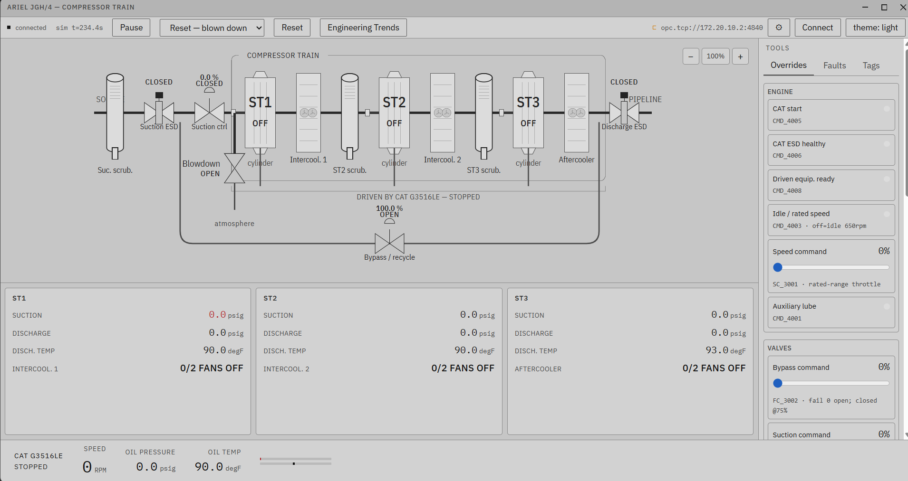
*Figure 10 — No PLC connected: train stopped and blown down, all ESD/blowdown valves fail-safe,
Overrides dock live.*

### The OPC UA endpoint in `config.yaml`

The endpoint is set under `opcua:` in `%LOCALAPPDATA%\CompressorSim\config.yaml` (Section 9):

```yaml
opcua:
  endpoint: "opc.tcp://localhost:4840"
  namespace_uri: "urn:symbolset:Device:Application:Symbol Set"
  browse_path_prefix: ["{ns}:Symbol Set", "{ns}:GVL_PLC"]
  watchdog_timeout_s: 2.0
  node_addressing: "auto"
```

For a PLC on the same machine, leave `endpoint` at `opc.tcp://localhost:4840`. For a PLC on
another device (a networked CODESYS PC or a physical panel), change the host — e.g.
`opc.tcp://172.20.10.2:4840`. `node_addressing: "auto"` (the default) searches the server's whole
address space for the simulator's known tag names and needs no `namespace_uri` or
`browse_path_prefix` configuration for a standard CODESYS target; those two keys, and
`node_id_pattern`, exist only for non-standard servers or as a manual override. The app needs to
be restarted after any change to `endpoint` (or any other `opcua:` key) in `config.yaml`, since
there is no live endpoint-switching control in the current UI.

### Opening the Connect to a PLC dialog

Click the settings icon next to the connection status in the header to open *Connect to a PLC*.

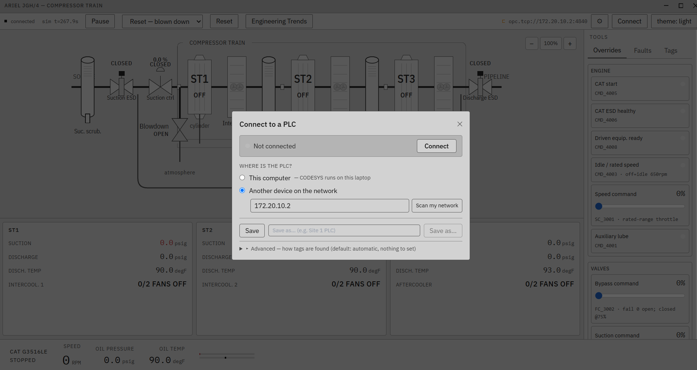
*Figure 11 — The Connect to a PLC dialog, not connected.*

**This computer** targets a CODESYS runtime on the same machine, at `opc.tcp://localhost:4840` —
the common bench-test case.

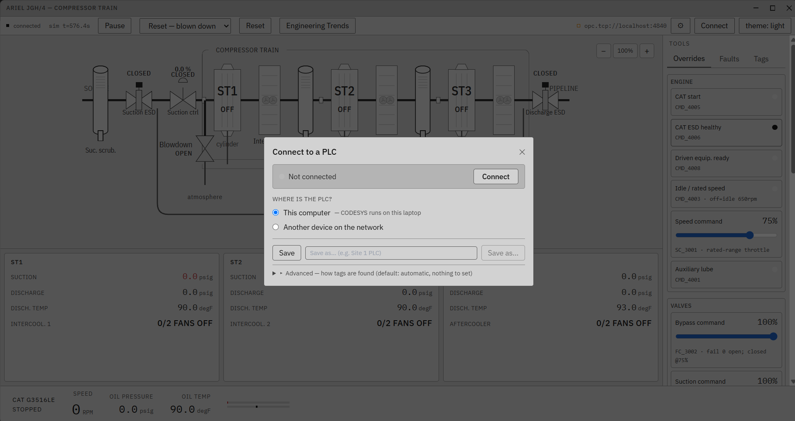
*Figure 12 — "This computer" selected as the PLC location.*

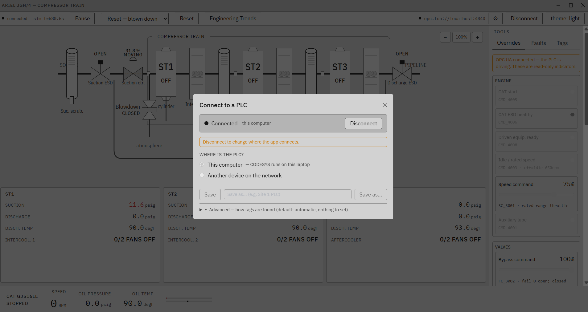
*Figure 13 — Connected — this computer. The header's connection dot and endpoint text update to
match.*

**Another device on the network** — for a physical panel or a separate PC — either types an IP
directly or uses *Scan my network* to discover OPC UA servers advertising on the local subnet.

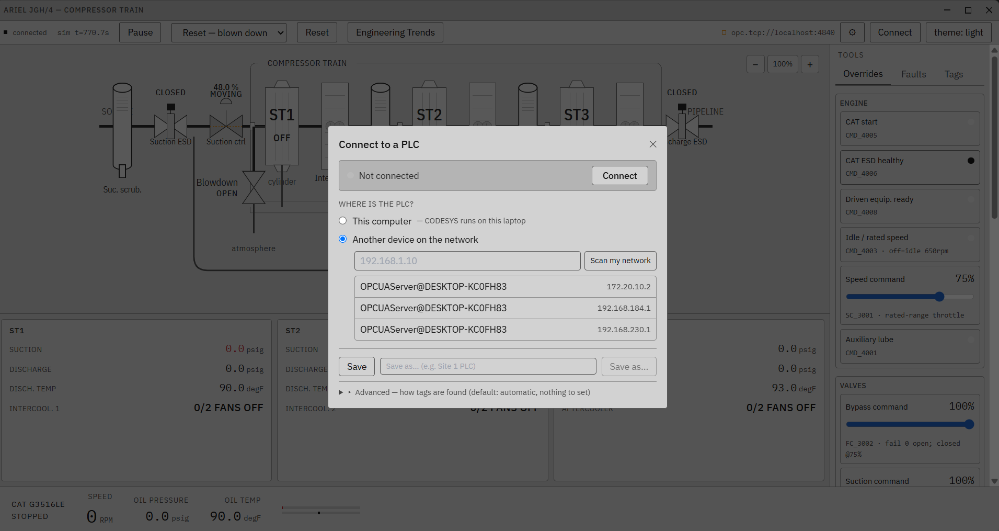
*Figure 14 — Scan my network: discovered OPC UA servers, hostname and IP.*

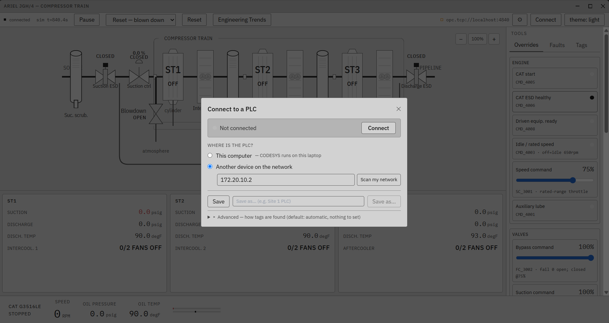
*Figure 15 — A discovered server's address populated after selection.*

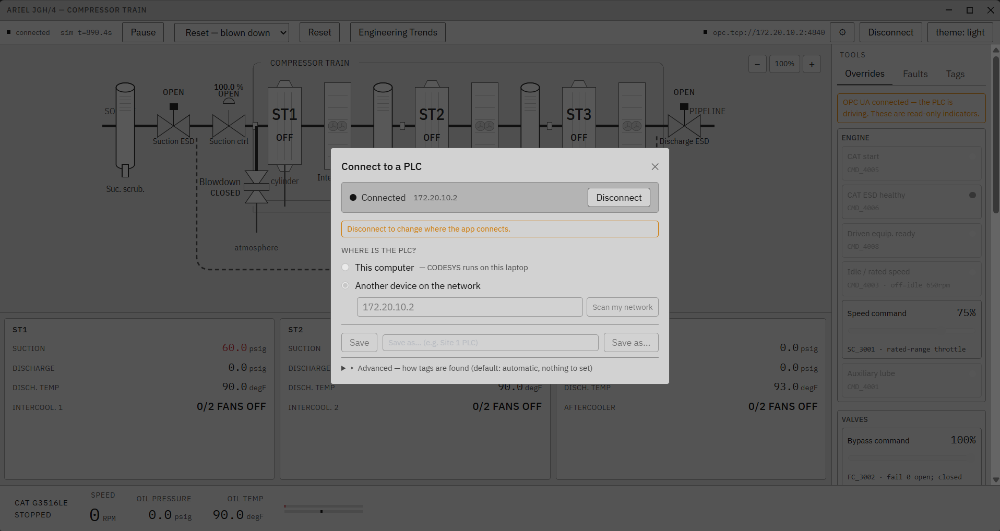
*Figure 16 — Connected to a remote runtime at 172.20.10.2.*

### Confirming the link is up

The UI indicator is the connection dot and status text in the header (and inside the Connect
dialog) — "Connected — this computer" or "Connected — <IP>". Once connected, every Overrides
tile that used to accept manual input is grayed out and shows the PLC's own commanded value
instead, with a banner across the top of the dock stating this explicitly.

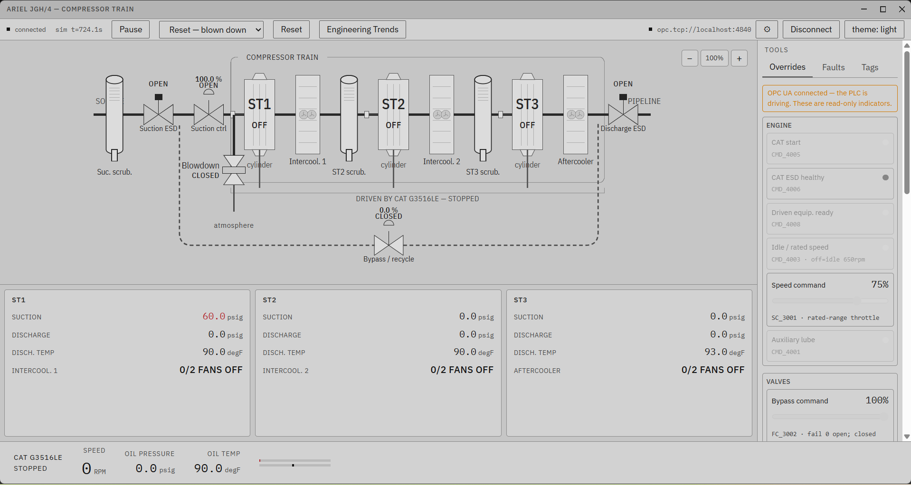
*Figure 17 — "OPC UA connected — the PLC is driving. These are read-only indicators," reflecting
the PLC's commanded values.*

On the log side, `app.log` records the connection lifecycle; a successful connect and any link
loss are both written there, which is the place to check when the UI status alone is
ambiguous (Section 17).

### What happens on link loss

The app increments a watchdog counter every 500 ms; if the peer's counter (or, on the app's own
side, the OPC UA server's time source) stops advancing for `watchdog_timeout_s` (2.0 s by
default), the link is declared failed and every command tag reverts to its documented fail value
(the full list is Appendix A):

| Command | Fail value | Physical result |
|---|---|---|
| `SC_3001` (speed) | 0 | Speed command drops to zero |
| `FC_3002` (bypass) | 0 | Bypass valve **opens** (fails open) |
| `FC_3003` (suction valve) | 0 | Suction valve **closes** (fails closed) |
| `CMD_4004` (blowdown solenoid) | off | Blowdown valve **opens** (fails open) |
| `CMD_4005`/`4006`/`4008`/`4009`/`4010`/`4001`/`4003`/`4011`/`4012` | off | ESDs close, cooler/lube commands drop, start command drops |

This mirrors a real fail-safe package: on loss of signal, the ESDs shut and the blowdown opens,
venting the unit (Section 4's mass-accumulation asymmetry governs how that unfolds). Operator
pushbuttons (`PB_5001`, `PB_5003`, `PB_5004`, `ESD_5002`) stay live and unaffected by link state,
since on the real unit these are hardwired to the PLC, not routed through this link.

### CODESYS-side requirements

If the target is a CODESYS soft-PLC, its Symbol Configuration needs to be published for the
connection to work — the simulator's `node_addressing: "auto"` mode locates tags by browsing the
server's exposed symbol set, and an unpublished symbol set means none of the compressor tags are
visible over OPC UA even though the application logic is running correctly. A Download to the
PLC regenerates its address space and invalidates any node references the client cached from
before the download; reconnecting (or restarting the simulator) afterward makes it re-discover
tags rather than hold stale references. This is a general OPC UA characteristic, not specific to
CODESYS, and applies the same way to a physical panel's OPC UA server after a program change. The
full CODESYS engineering-environment procedure (installing the runtime, logging in, forcing a tag
to verify the link) is documented in the predecessor report, `Report/1st_draft_report.pdf`, Part
II §0.10, and is not reproduced here.

### Symbol Publishing and Device Security Settings

The device tree of a CODESYS Control Win project (Device → PLC Logic → Application →
Communication Manager → OPC UA Server) is where the Symbol Publishing object controlling which
global variables are exposed as OPC UA nodes lives, alongside the Communication Settings tab used
earlier to confirm the gateway and target device.

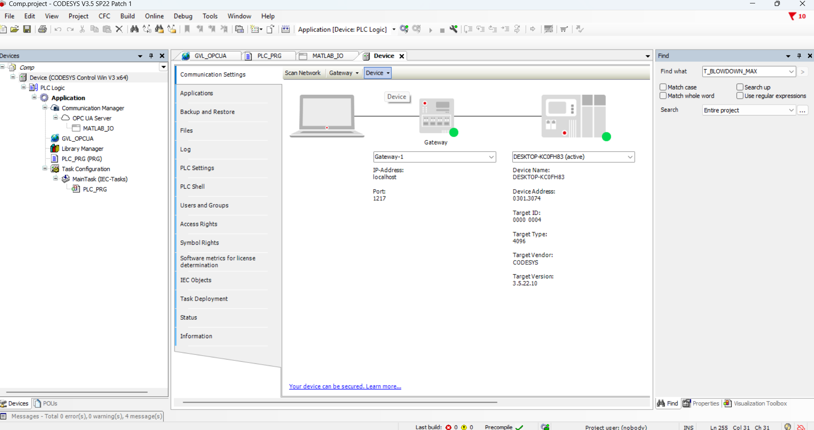
*Figure 18 — CODESYS Devices tree for a project with symbol publishing configured, and the
Communication Settings tab showing the active target device.*

Two device-level settings gate every OPC UA client — this application included — and both
default to values that **block** connections, so both must be changed explicitly on a fresh
CODESYS install:

1. **Device Security Settings** (Device menu → Security Settings…): `CommunicationMode` must be
   set to `ALL` (the default restricts which channels are permitted and blocks external client
   connections) and `Activation` must be set to `ACTIVATED` (this also defaults to a
   connection-blocking state).

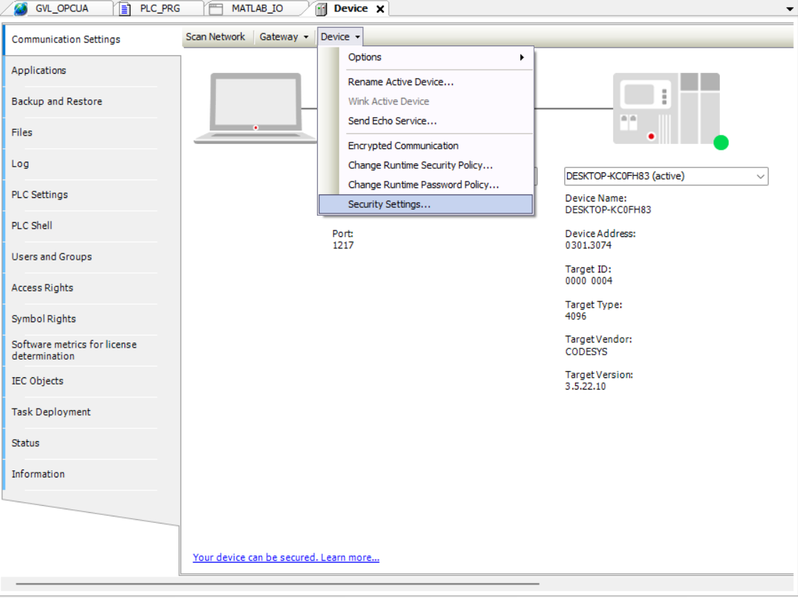
*Figure 19 — Menu location for Device Security Settings, under the Device dropdown.*

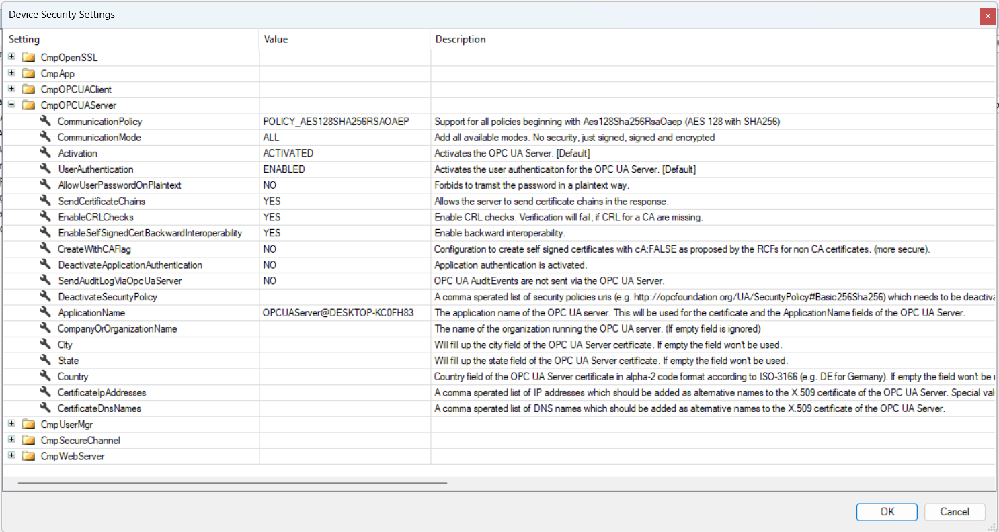
*Figure 20 — Device Security Settings dialog with the two required non-default values:
`CommunicationMode = ALL`, `Activation = ACTIVATED`, under `CmpOPCUAServer`.*

2. **Runtime Security Policy** (Device menu → Change Runtime Security Policy…): encryption set
   to *Optional*, *Code Signing = All*, user management set to *Optional*, and *Allow anonymous
   login* enabled — anonymous login lets a registered OPC UA client connect without credentials
   even if user management is otherwise on.

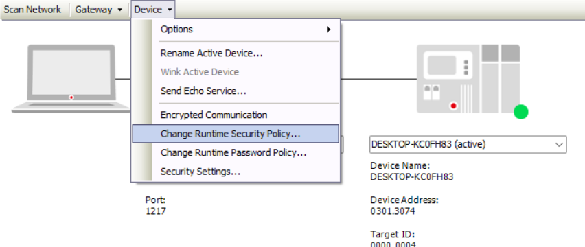
*Figure 21 — Menu location for the Runtime Security Policy, under the Device dropdown.*

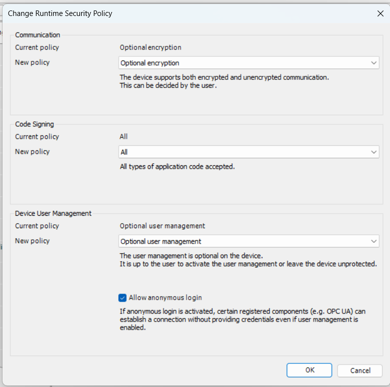
*Figure 22 — Runtime Security Policy dialog: Optional encryption, Code Signing = All, Optional
user management, Allow anonymous login enabled.*

Both device-level settings default to values that block connections, so the runtime can appear to
start normally while silently refusing every incoming OPC UA client, including this application.
If the app cannot connect and `app.log` shows no response from an endpoint that is otherwise
reachable, these two dialogs are the first place to check.

---

## 11. PLC Development Roadmap

A recommended order of work for building the PLC application against this simulator, from first
communications to a fully validated sequence. Nothing here is enforced by the simulator — it is a
suggested path through the work, not a requirement.

### Stage 1 — Establish Communications

1. Install the simulator (Section 9).
2. Start (or configure) the CODESYS runtime and confirm it is actually running the application,
   not just downloaded (Section 10).
3. Publish the CODESYS Symbol Configuration so the compressor tags are visible over OPC UA
   (Section 10, Symbol Publishing and Device Security Settings).
4. Connect the simulator to the runtime and confirm "Connected" in the header (Section 10).
5. Force one safe PLC tag (e.g. `CMD_4005`) and observe the corresponding response in the
   simulator (Section 10, Verifying the Link).
6. Confirm simulator feedback (a measurement tag) reaches the PLC side, closing the loop in both
   directions.

This is expanded into a repeatable procedure in Section 16, "First PLC Commissioning Test" —
treat that as Stage 1's acceptance test.

### Stage 2 — Create the I/O Mapping

Map every tag in Appendix A into the PLC project: commands (speed, valve, engine, cooler),
process measurements (pressures, temperatures), limit switches, engine-running feedback,
oil-pressure-healthy, cooler run feedback, the watchdog counter, and the always-live
operator/ECU pushbuttons. Section 12 groups these by function rather than tag number, to make
this mapping pass faster.

### Stage 3 — Implement Equipment-Level Logic

Individual output logic for each piece of equipment, independent of sequencing: valve open/close
commands, auxiliary lube on/off, engine start/stop, cooler motor commands, speed reference,
recycle/bypass positioning. Section 12's "What Should Happen When I Issue a Command?" states the
expected simulator response for each.

### Stage 4 — Implement Permissives

> **RECOMMENDED SOFTWARE STRUCTURE, NOT SIMULATOR-ENFORCED.** The simulator does not require,
> check, or enforce any permissive. Everything in this stage is a recommended engineering
> practice, not a behaviour the simulator will validate for you.

Typical permissives to consider: communications healthy (watchdog, Section 12); ESD healthy;
driven-equipment-ready; correct valve state before a transition; lubrication pressure healthy;
and whatever process conditions the project requires before a step proceeds. Do not invent
thresholds or timers the project has not specified — mark them *project-specific / to be defined*
rather than guessing a realistic-looking number.

### Stage 5 — Implement the Sequence

Develop the startup/run/stop/shutdown state machine. Section 14's reference sequence and
Section 12's sequence/state reference table are a starting point, not a specification — see "The
Predecessor Sequence" note in Section 12.

### Stage 6 — Add Alarm and Trip Evaluation

Evaluate alarms and trips against the simulator's measurement and fault-affected tags. The
simulator never evaluates alarms itself (Section 1); anything coloured on the P&ID or drawn as a
dashed line on a trend is a display convenience only, not a live alarm the PLC can read.

### Stage 7 — Fault-Test the PLC

Work through the Faults tab (Section 15) systematically, confirming each fault produces its
documented tag-level effect and that the PLC logic under test reacts as intended.

### Stage 8 — Validate Stop, Shutdown, and Recovery Behaviour

Exercise normal stop, unconditional/emergency shutdown, a failed start, lube failure, cooling
failure, blocked discharge, instrument faults, an OPC UA link loss, and restart/reset behaviour
after each. Section 16's Acceptance Test Checklist is organised around exactly these cases.

### Recommended PLC Software Architecture

> **RECOMMENDED ENGINEERING ORGANISATION, NOT A SIMULATOR REQUIREMENT.** The decomposition below
> is one reasonable way to organise a PLC application against this interface. The simulator has
> no opinion on program structure, POU naming, or coding style — only on the tag values it reads
> and writes.

```text
PLC Application
|
+-- IO Mapping
|
+-- Communication Supervision (watchdog / link health)
|
+-- Equipment Control
|   +-- Engine
|   +-- Auxiliary Lube
|   +-- Suction ESD
|   +-- Discharge ESD
|   +-- Blowdown
|   +-- Suction Control Valve
|   +-- Bypass Valve
|   +-- Coolers
|
+-- Permissives
|
+-- Compressor Sequence
|
+-- Alarm / Trip Evaluation
|
+-- Shutdown Management
|
+-- Diagnostics / HMI
```

If IEC 61131-3 organisation is useful: a GVL for the OPC UA-mapped tags, one function block per
equipment item, an enum-driven state machine for the sequence, and structures for grouping
related permissive/alarm bits are all reasonable choices — none of this is dictated by the
simulator, and an existing CODESYS project's established style should take precedence over any
suggestion here.

---

## 12. PLC / Simulator Interface

This section is the practical reference for wiring up and coding against the simulator: which
tags matter for which subsystem, which ones have counter-intuitive polarity, what to expect in
the simulator after issuing a command, what "healthy" looks like at the design point, and how a
normal stop differs from an unconditional shutdown. The full, alphabetically-complete tag list
with ranges and fail values is Appendix A; this section groups the same tags by function instead.

### Command / Feedback Cheat Sheet

**Engine** — `SC_3001` (speed command), `CMD_4003` (idle/rated select), `CMD_4005` (engine
start), `CMD_4006` (CAT ESD healthy), `CMD_4008` (driven-equipment-ready), `ST_1008` (speed
feedback), `ST_2010` (engine running), `XA_6002`/`XS_6003` (CAT alarm/shutdown status).

**Lubrication** — `CMD_4001` (auxiliary lube), `PT_1005` (compressor oil pressure), `PS_2009`
(oil pressure healthy), `PT_1007` (engine oil pressure).

**Process Valves** — `FC_3002` (bypass command), `FC_3003` (suction valve command), `CMD_4004`
(blowdown solenoid), `CMD_4009` (suction ESD), `CMD_4010` (discharge ESD), `ZS_2001`–`2008`
(valve limit switches).

**Cooling** — `CMD_4011`/`4012` (cooler motor 1/2 run), `RS_4011`/`4012` (cooler run feedback),
`TT_2013` (aftercooler temperature), `TT_2014` (engine jacket-water temperature).

**Process Measurements** — `PT_1001` (suction), `PT_1002`/`1003`/`1004`/`1006` (stage
1/2/3/final discharge), `TT_2004`–`2007` (cylinder discharge temperature), `TT_2009`–`2012`
(packing temperatures).

**Communication** — `WD_6001` (heartbeat counter, increments every 500 ms — see "Watchdog and
Communication Supervision" below).

### Important: Command Polarity

> **IMPORTANT.** Do not assume `TRUE` means "open" or "on" for every tag. Command meaning depends
> on the specific device and its fail-safe philosophy, and getting this backwards is one of the
> easiest ways for a new PLC engineer to write logic that looks correct but drives the package the
> wrong way.

| Tag | Energised / commanded TRUE means | Loss of command / de-energised means |
|---|---|---|
| `CMD_4004` (blowdown solenoid) | Blowdown valve **closed** | Blowdown valve **opens** — fails open |
| `CMD_4009` (suction ESD) | Valve **open** | Valve **closes** — fails closed |
| `CMD_4010` (discharge ESD) | Valve open (by convention, matching the suction ESD) | Valve **closes** — fails closed |
| `FC_3002` (bypass command) | Higher % = more **closed** | 0% = valve fully **open** — fails open |
| `FC_3003` (suction valve command) | Higher % = more **open** | 0% = valve fully **closed** — fails closed |

The pattern to remember: every ESD-type and blowdown element is wired so that *losing signal
fails toward the safe, vented, isolated state* — ESDs closed, blowdown open. `FC_3002` (bypass)
follows the same fail-open philosophy but is commanded as an analog percentage rather than a
discrete, so "0% commanded" and "signal lost" produce the same fully-open result. This mapping is
restated where it matters operationally in Section 10, "What Happens on Link Loss," and is not
re-derived each time it recurs below.

### What Should Happen When I Issue a Command?

**Auxiliary Lube On (`CMD_4001`).** Compressor oil pressure (`PT_1005`) builds toward the 55 psig
prelube target (Section 5, eq. 15). `PS_2009` changes state once the modelled pressure crosses its
healthy threshold. The prelube ramp has a real time constant — it does not jump to target
instantly.

**Engine Start (`CMD_4005`, subject to its prerequisite commands).** Speed (`ST_1008`) progresses
through cranking (0→200 rpm at +70 rpm/s), then acceleration toward the idle reference (650 rpm)
at +50 rpm/s, then tracks the rated-speed reference once `CMD_4003` and `SC_3001` move it into the
850–1000 rpm range. See Section 3 and Section 14 for the full permissive chain this depends on.

**Close Bypass / Load the Compressor (`FC_3002` toward 100%).** More compressor flow is routed
toward discharge/process rather than recycling to suction. Discharge pressures
(`PT_1002`/`1003`/`1004`/`1006`) build stage over stage; the suction/discharge pressure
relationship shifts accordingly.

**Open Bypass / Unload (`FC_3002` toward 0%).** Discharge gas recycles toward suction. Suction
pressure (`PT_1001`) tends to rise; discharge pressures tend to fall. The engine keeps running
throughout — this is the mechanism for unloading without a full stop.

**Blowdown (`CMD_4004` de-energised, or its permissives never asserted).** The *suction* volume
vents toward atmosphere. Discharge pressure does *not* necessarily collapse at the same time —
discharge-side mass can only leave through the bypass valve into suction and then out the vent, so
with the bypass closed, discharge pressure can remain high even while suction is fully vented.
This is not a model defect; it is the mass-accumulation asymmetry explained in full in Section 4
and is the single most common point of confusion for a first-time reader of this simulator's
behaviour.

### Normal Operating Expectations ("What Good Looks Like")

The table below restates the design-point values from Section 6 as a fast sanity check while
coding or commissioning. These are simulator design-point/reference values for a *generic*
package, not a guarantee of any specific real machine's performance (Section 7).

| Quantity | Design-point value |
|---|---|
| Suction pressure | ~29.8 psig |
| Stage 1 discharge pressure | ~117.3 psig |
| Stage 2 discharge pressure | ~377.2 psig |
| Final discharge pressure | ~1149.0 psig |
| Engine speed (rated) | 850–1000 rpm |
| Compressor mass flow | ~0.945 kg/s |
| Cylinder 1 / 2 discharge temperature | ~245.4 / 251.7 °F |

### Normal Stop vs. Unconditional Shutdown (USD)

Getting this distinction right is central to sequence design, because the simulator produces
visibly different pressure outcomes depending on command *ordering* — and enforces none of that
ordering itself.

| | Normal stop | Unconditional shutdown / USD |
|---|---|---|
| Intent | PLC deliberately unloads, isolates, and depressurises in a controlled order | Shutdown actions occur immediately, per the PLC's own shutdown philosophy |
| Simulator consequence | If the PLC opens bypass and closes the ESDs before opening blowdown, discharge-side mass has already had a path back to suction, so final pressures settle lower and more evenly | If blowdown opens immediately without that ordering, the suction volume vents fast while discharge pressure can remain high — trapped behind a closed or partially-open bypass |

> **IMPORTANT.** The simulator intentionally does not enforce the "correct" ordering of ESD
> closure, bypass opening, and blowdown opening. Whether a given shutdown sequence leaves the
> package in a sensible final pressure state is exactly what the PLC is being tested on — see
> Section 4 for the underlying mass-accumulation mechanism and Section 14 for the reference
> walkthrough.

### Watchdog and Communication Supervision

`WD_6001` increments every 500 ms while the simulator is running and the link is healthy
(Section 10). A PLC can supervise this the same way it would supervise any heartbeat: confirm the
value is actually changing, not merely present. A stopped or stale `WD_6001` is evidence of a
simulator-side communication failure. What the PLC should *do* about that — trip, alarm, hold last
state, or something else — is a project-specific design decision this document does not
prescribe. Section 10, "What Happens on Link Loss," documents the simulator's own fail-value
behaviour on its side of a dropped link, which is the complementary half of this picture.

### PLC Sequence / State Reference Table

> **REFERENCE ONLY — NOT ENFORCED BY SIMULATOR.** The predecessor rig's reference sequence names
> the phases below (Section 14). The simulator implements none of these states, timers, or
> transitions — it only responds to whatever commands are asserted at whatever time they are
> asserted. Any timer, threshold, or permissive not already stated elsewhere in this report is
> marked *project-specific* below rather than invented.

| Phase | Likely PLC command | Process response to observe | Feedback to monitor | Possible failure mode |
|---|---|---|---|---|
| READY | Permissives asserted, no equipment commanded yet | None — package at rest | ESD/blowdown limit switches, no active faults | Project-specific / to be defined |
| PURGE | Not modelled by this simulator | Not modelled — no purge-gas system in this simulator | Not applicable | Not enforced by simulator |
| BLOWDOWN | `CMD_4004` de-energised (or never energised) | Suction volume vents toward atmosphere (Section 4); discharge pressure may remain elevated depending on bypass state | `PT_1001` falling, blowdown limit switch | Project-specific timer for "fully vented" |
| PRELUBE | `CMD_4001` energised | `PT_1005` ramps toward the 55 psig prelube target (Section 5, eq. 15) | `PT_1005`, `PS_2009` | Low lube pressure fault, slow lube build fault (Section 15) |
| CAT_START | `CMD_4005` energised, with `CMD_4006`/`CMD_4008` asserted | `ST_1008` ramps through cranking then acceleration toward idle | `ST_1008`, `ST_2010` | Engine-fails-to-start fault clamps speed at 550 rpm (Section 15) |
| WARMUP | Engine held at idle (650 rpm) before loading | Speed steady near idle; oil/cylinder temperatures continue settling | `ST_1008`, `TT_2001` | Project-specific warmup duration — not defined by simulator |
| LOADING | `CMD_4003` selected, `SC_3001` raised, `FC_3003` opened, `FC_3002` closed toward the load position | Stage pressures build per Section 5 eq. 2–3; flow ramps with speed and valve position | `PT_1001`–`1006`, `ST_1008` | Blocked discharge, valve-stuck faults (Section 15) |
| RUNNING | Steady rated-speed commands maintained | Design-point values approached (see "Normal Operating Expectations" above) | All process measurements | Any Faults-tab condition (Section 15) |
| UNLOADING | `FC_3002` opened toward suction | Discharge pressures fall, suction rises, engine keeps running (see "Open Bypass / Unload" above) | `PT_1001`–`1006` | Project-specific unload criteria |
| COOLDOWN | Engine run permissives de-asserted; speed coasts down (τ = 6 s) | `ST_1008` decays toward zero per the coastdown time constant | `ST_1008` | Project-specific cooldown duration before next step |
| NORMAL_STOP_POSTLUBE | `CMD_4001` may remain energised after engine stop | `PT_1005` holds at the prelube target if lube stays commanded | `PT_1005` | Project-specific postlube duration |
| SHUTDOWN / USD | ESDs de-energised, blowdown de-energised immediately, without waiting for the normal-stop ordering | Suction vents fast; discharge pressure state depends entirely on bypass position at the moment of trip (see "Normal Stop vs. USD" above) | `PT_1001`–`1006`, ESD/blowdown limit switches | Command ordering error — trapped high discharge pressure is a symptom, not a simulator fault |

---

## 13. The Operator Interface

The right-hand tool dock has three tabs, available regardless of PLC connection state, plus a
full-screen Engineering Trends view opened from the header:

| Screen | What it's for |
|---|---|
| **Overrides** | Manual control panel when no PLC is connected; read-only PLC command echo once one is |
| **Faults** | Fault injection for testing PLC fault handling (Section 15) |
| **Tags** | Full flat table of every OPC UA tag and its current value |
| **Engineering Trends** | Full-screen strip charts of key tags, opened via a header button |

The app supports a dark theme (toggled from the header), shown below with the unit running at
rated speed under PLC control.

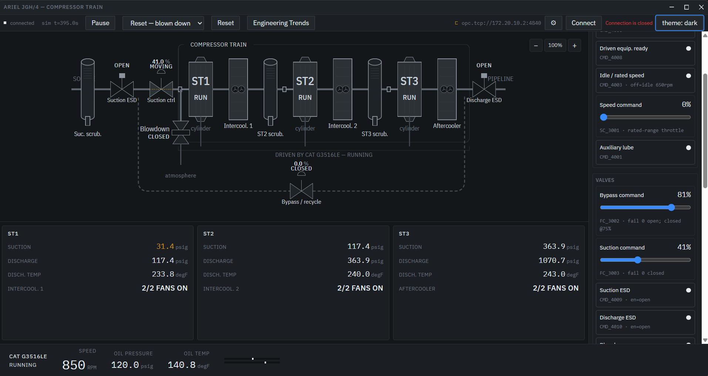
*Figure 23 — All three stages RUN, coolers ON, discharge pressures building stage over stage
(ST1 117 psig, ST2 364 psig, ST3 1071 psig), engine at 850 rpm.*

**Overrides — status feedback and always-live inputs.** Beyond the Engine and Valves groups
(Section 10), the dock also has a read-only status block for sensor/feedback tags the PLC does not
command, and a group of operator/ECU pushbuttons that stay live even while a PLC is connected.

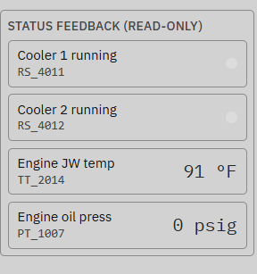
*Figure 24 — Status feedback (read-only): cooler run feedback (`RS_4011`, `RS_4012`), engine
jacket-water temperature (`TT_2014`), engine oil pressure (`PT_1007`).*

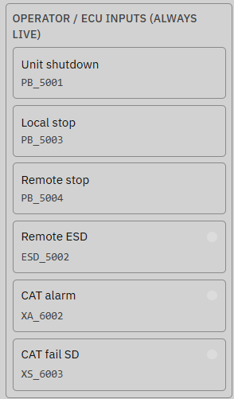
*Figure 25 — Unit shutdown (`PB_5001`), local stop (`PB_5003`), remote stop (`PB_5004`), remote
ESD (`ESD_5002`), CAT alarm (`XA_6002`), CAT fail SD (`XS_6003`) — hardwired-style, always
editable regardless of PLC connection.*

**Faults.** Grouped by subsystem, with a single *Clear all faults* control at the top. Faults are
applied instantly and independently of Reset. See Section 15 for the full fault table.

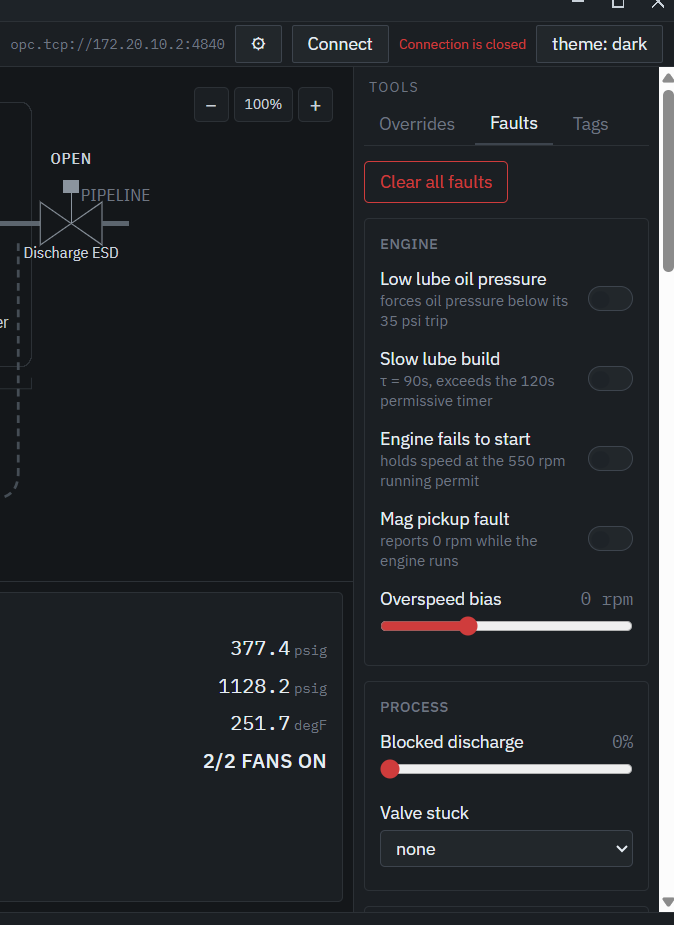
*Figure 26 — Engine faults (low lube oil, slow lube build, engine fails to start, mag pickup,
overspeed bias) and the start of the Process group.*

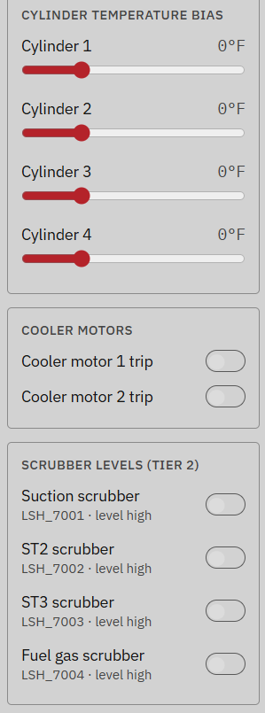
*Figure 27 — Per-cylinder temperature bias, cooler motor trip switches, Tier 2 scrubber-level
switches.*

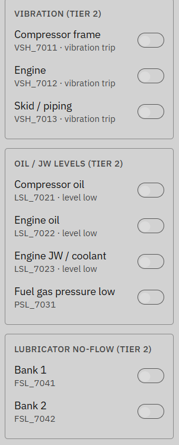
*Figure 28 — Further Tier 2 discrete faults: vibration trips, oil/JW low-level switches, fuel-gas
pressure low, lubricator no-flow.*

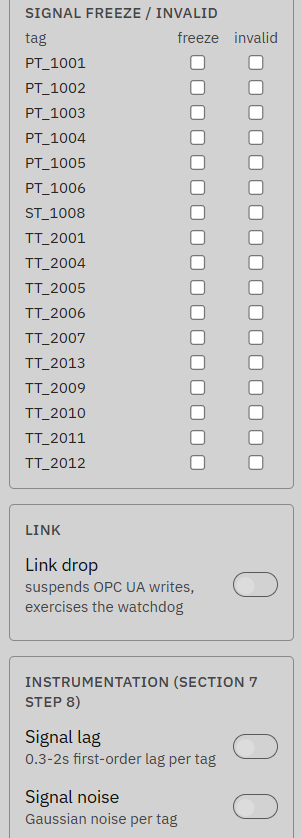
*Figure 29 — Signal freeze/invalid per analog tag, Link drop switch, start of Instrumentation
group.*

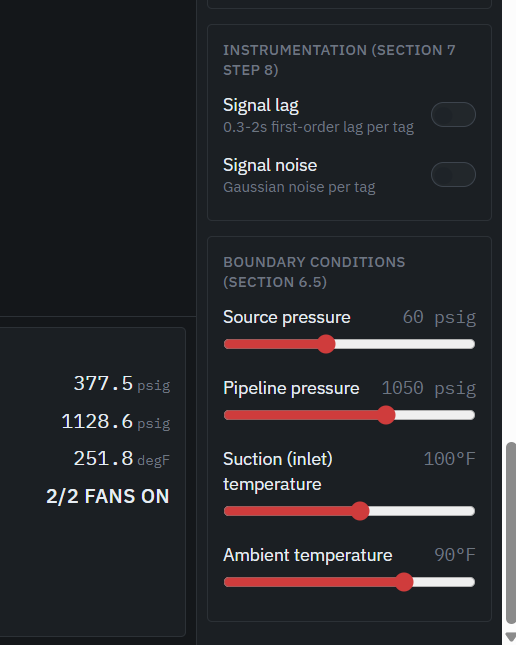
*Figure 30 — Signal lag/noise, and Boundary Conditions (source pressure, pipeline pressure,
suction/ambient temperature).*

**Tags.** A flat, live-updating list of every OPC UA tag the simulator exposes and its current
value — useful for confirming exactly what a connected PLC sees without cross-referencing the
P&ID or Overrides dock tag by tag.

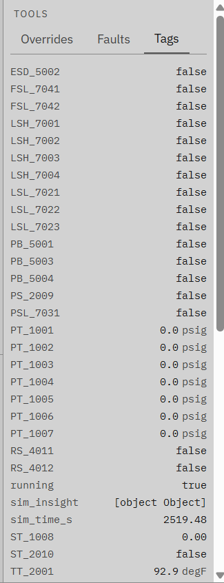
*Figure 31 — Tags tab: a flat, live-updating list of tag names and values.*

**Engineering Trends.** Up to twelve tags plotted at once against a rolling buffer, sampled at
10 Hz on the simulation's own time base. Dashed lines mark configured engineering limits for
reference — the simulator itself never evaluates alarms (Section 1).

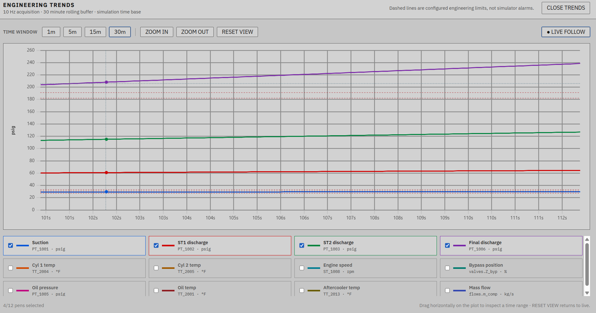
*Figure 32 — Four pressure pens (suction, ST1, ST2, final discharge) over a 30-minute rolling
window during a startup.*

---

## 14. Running the Simulator

This walkthrough uses the real tags described in Section 13 and Appendix A. Sequencing — deciding
what order to assert these commands in, and how long to wait between them — is the job of the
connected PLC; this application supplies no sequencer of its own (Section 1). Everything below
describes what the operator (through a real PLC, or by hand via the Overrides dock when no PLC
is connected) does, and what the simulator does in response. This differs from the earlier
Simulink/CODESYS model, which bundled its own reference sequencer for standalone demonstration —
without a PLC attached, this application will not run a startup sequence on its own.

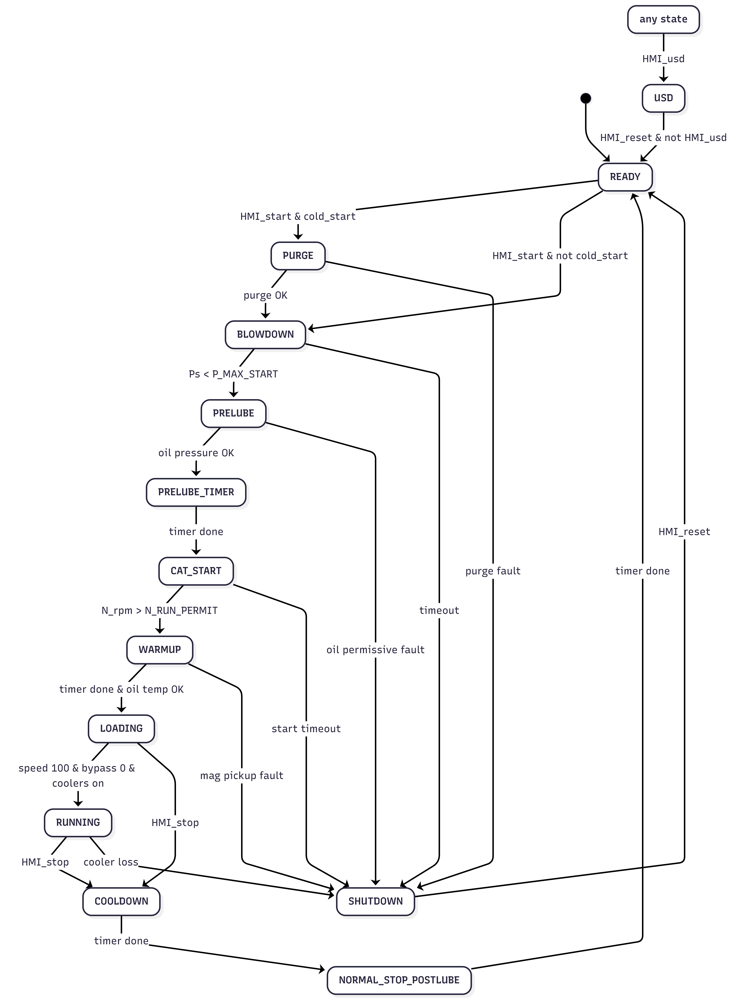
*Figure 33 — The predecessor Simulink/CODESYS rig's reference sequencer state diagram (READY →
PURGE → BLOWDOWN → PRELUBE → CAT_START → WARMUP → LOADING → RUNNING, with COOLDOWN /
NORMAL_STOP_POSTLUBE and SHUTDOWN / USD exit paths). Shown for context only — this application
implements none of these states, timers, or transitions itself; every step below is something a
connected PLC's own sequencer (which may follow this same state machine, or a different one)
must decide and command.*

1. **Launch and confirm the link.** Start the app (Section 9); connect to the target PLC (Section
   8) and confirm the header shows "Connected." With no PLC connected, the same sequence can be
   driven by hand from the Overrides dock for a demonstration, since every command tile there
   maps to the same tag the PLC would otherwise drive.

2. **Bring the package from stopped to running.** The PLC (or the operator, via Overrides)
   asserts the permissive chain: `CMD_4009` (suction ESD, energised = open) and `CMD_4010`
   (discharge ESD) open; `CMD_4006` (CAT ESD healthy) and `CMD_4008` (driven-equipment-ready) are
   asserted; `CMD_4001` (auxiliary lube) commands the prelube pump, and `PT_1005`/`PS_2009`
   (oil-pressure-healthy) is watched as it builds toward the 55 psig prelube target (eq. 15).
   Once oil pressure is healthy, `CMD_4005` (CAT engine start) is asserted: speed ramps through
   cranking (0→200 rpm at +70 rpm/s), then accelerates toward the idle reference (650 rpm) at
   +50 rpm/s. Selecting `CMD_4003` (idle/rated) and driving `SC_3001` up moves the reference
   into the 850–1000 rpm rated range; `FC_3003` (suction valve) opens and `FC_3002` (bypass)
   closes off the 100%-open failed-safe position to route flow toward the process.

3. **Observe the transients.** Watch `PT_1001`/`1002`/`1003`/`1006` build stage over stage as the
   equal-ratio staging (Section 5, eq. 2–3) takes effect, and `TT_2004`/`2005` rise toward their
   polytropic targets (eq. 11–12) as compression begins — this is the same running state shown in
   Figure 23. The oil and cooling lags (eq. 14) mean pressures and flow respond quickly (seconds)
   while oil and cylinder temperatures settle over tens of seconds to minutes, exactly as
   Section 4's mass-accumulation framing predicts.

4. **Unload via bypass.** Opening `FC_3002` (bypass) recycles discharge gas back to suction
   without stopping the engine — `PT_1001` rises and `PT_1002`–`1006` fall as flow diverts, the
   same recycle path used to test unload/reload logic without a full shutdown.

5. **Stop.** A normal stop de-asserts the run permissives; the ESDs close and speed coasts down
   ($\tau=6$ s, eq. 12 phase table). Only once the ESDs are closed does de-asserting `CMD_4004`
   open the blowdown valve, venting the *suction* volume — discharge pressure holds nearly
   constant through this because it has no path to lose mass except back through the (now-closed
   or still-recycling) bypass valve, exactly the asymmetry described in Section 4. This is why a
   normal stop and an unconditional shutdown (blowdown opens immediately, without waiting for the
   ESDs) leave the package in different states, and why a PLC's stop sequence needs to get that
   ordering right independent of anything this simulator enforces — it enforces nothing.

---

## 15. Fault Injection

Every fault below is local to the application and never exposed on OPC UA — the PLC under test
cannot see or clear its own faults through the link, only through whatever effect the fault has
on the process tags it reads. A single *Clear all faults* control resets every fault at once (a
separate, explicit action from Reset).

| Fault | Operator control | Physical effect | What the PLC should be expected to do |
|---|---|---|---|
| Low lube oil pressure | Toggle | Forces `P_oil` below its 35 psi trip threshold | Trip on the low-lube-oil-pressure shutdown |
| Slow lube build | Toggle | Sets the oil-pressure lag time constant to 900 s, pushing the 10 psi start permissive crossing well past a 120 s oil-permissive timer | Trip on the Oil Permissive Pressure Fault timer |
| Engine fails to start | Toggle | Clamps `N` at 550 rpm, never reaching a running speed | Trip on the Engine Failed to Start timer |
| Mag pickup fault | Toggle | Forces reported `ST_1008` to 0 while the engine is actually running | Detect a speed-signal/other-evidence mismatch, per the PLC's own logic |
| Overspeed sensor bias | Slider, rpm offset | Adds a continuous offset to reported `ST_1008` | Trip on overspeed at whatever threshold the PLC applies |
| Blocked discharge | Slider, 0–100% | Reduces the effective $K_{proc}$ flow coefficient | Trip or alarm on high discharge pressure |
| Cylinder temp bias | Slider per cylinder (1–4), °F | Adds an offset to the corresponding `TT_2004`–`2007` reading | Trip or alarm on high cylinder discharge temperature, per cylinder |
| Valve stuck | Per-valve select (bypass, suction, suction ESD, discharge ESD, blowdown) | Freezes that valve's position regardless of command | Trip on valve-misalignment timer (position feedback vs. command mismatch) |
| Signal freeze | Per analog tag (set) | Holds the tag's last transmitted value | Detect a stale/non-updating signal, per the PLC's own staleness logic |
| Signal invalid | Per analog tag (set) | Drives the tag out of its transmitter range | Detect an out-of-range / bad-quality signal |
| Cooler motor trip | Per motor (1, 2, or both) | Drops `RS_4011`/`RS_4012` run feedback while the command stays commanded on | Detect a run-feedback mismatch, per motor |
| Link drop | Toggle | Suspends all OPC UA writes from the simulator | Exercise the PLC's own watchdog against a stale/frozen link |
| Tier 2: scrubber level high, vibration trip, oil/JW level low, fuel-gas pressure low, lubricator no-flow | Per-item toggles | Drive the corresponding Tier 2 discrete tag true | Trip or alarm per the associated protective function |

A few of these faults are broader in scope than the earlier Simulink model: valve-stuck applies
to any of the five valves rather than bypass only, cooler motor trip is per-motor rather than
both fans together, signal freeze covers any analog tag rather than discharge pressure alone,
signal invalid is new, and cylinder temperature bias is independent per cylinder rather than one
shared value. Two numeric values also differ — the slow-lube-build time constant and the
engine-fails-to-start speed clamp — both chosen to exercise the same PLC permissive timers as the
original values did, just with different margins. Full detail is in `DISCREPANCIES.md`.

---

## 16. PLC Validation and Commissioning Tests

### First PLC Commissioning Test

A small, safe, deterministic test to prove the complete signal path end to end before attempting
the full compressor sequence. This is the same tag-forcing mechanism demonstrated in Section 10,
"Verifying the Link," generalised into a repeatable first-commissioning step.

1. Establish the OPC UA connection (Section 10) and confirm "Connected" in the header.
2. Verify `WD_6001` is incrementing and that expected feedback tags (e.g. `PS_2009`, `ST_2010`)
   are present and at their expected at-rest values.
3. From the PLC, command one safe output — `CMD_4005` is a convenient choice, since it drives a
   visible indicator on the P&ID and has no destructive effect on its own without the rest of the
   start permissive chain also being asserted.
4. Observe the corresponding response in the simulator HMI (or the Tags tab, Section 13).
5. Remove the command from the PLC side.
6. Confirm the feedback returns to its prior state.
7. Confirm the PLC is receiving the simulator's process measurements (e.g. `PT_1001`) and that
   they read plausible values for the current state (Section 12, "Normal Operating
   Expectations").
8. Compare the tag table on both sides — the PLC's symbol/watch view and the simulator's Tags tab
   (Section 13) — to confirm no tag is silently missing or mismatched.

Passing this test proves the wiring, addressing, and OPC UA plumbing are correct. It does **not**
prove the PLC's sequence logic is correct — that is a separate validation step, below.

### Acceptance Test Checklist

> **PROJECT-SPECIFIC PASS/FAIL CRITERIA.** This checklist states what to *observe*, not what the
> "correct" PLC response must be in every case — most of that is a project requirement this
> document has no authority to define. Where a specific response is not documented elsewhere in
> this report, the expected-response column says so explicitly rather than inventing one.

**Communications**

| Check | Expected observation |
|---|---|
| Simulator connects to the OPC UA server | Header shows "Connected"; `app.log` records a successful connect (Section 10) |
| PLC command changes appear in the simulator | Forcing a command tag from CODESYS is reflected in the HMI within one update cycle (Section 10) |
| Simulator feedback appears in the PLC | Measurement tags update in the PLC's watch view as the process changes |
| Watchdog supervision works | `WD_6001` increments continuously; a stalled value is detectable by the PLC (Section 12) |
| Reconnect works after a CODESYS download | Reconnecting (or restarting the simulator) re-discovers tags rather than holding stale node references (Section 10) |

**Start Sequence**

| Check | Expected observation |
|---|---|
| Prelube is commanded | `CMD_4001` asserted; `PT_1005` ramps toward 55 psig |
| Oil-pressure permissive is respected | Project-specific / engineer-defined — the simulator only reports `PT_1005`/`PS_2009`, it does not decide when a start may proceed |
| Engine start sequence works | `ST_1008` progresses through cranking then acceleration once `CMD_4005` and its prerequisites are asserted |
| Speed reaches idle | `ST_1008` approaches 650 rpm |
| Rated transition works | `ST_1008` moves into the 850–1000 rpm range once `CMD_4003` and `SC_3001` command it |
| Valves reach expected positions | `FC_3002`/`FC_3003` and their limit switches (`ZS_2001`–`2008`) track the commanded position, rate-limited per Section 5 eq. 13 |
| Compressor loads correctly | Stage pressures build per "Close Bypass / Load the Compressor" in Section 12 |

**Running**

| Check | Expected observation |
|---|---|
| Stage pressures rise correctly | Monotonic staging matching Section 12's "Normal Operating Expectations" table |
| Cooler status works | `RS_4011`/`4012` track `CMD_4011`/`4012`; temperatures respond per Section 5 eq. 16 |
| Trends display expected process behaviour | Engineering Trends (Section 13) show smooth, physically plausible transients, not step discontinuities |
| Unload/reload works | Opening/closing `FC_3002` produces the response documented under "Open/Close Bypass" in Section 12 |

**Normal Stop**

| Check | Expected observation |
|---|---|
| Machine unloads correctly | Bypass opens before ESDs close, per the PLC's own sequence |
| Engine stops | `ST_1008` coasts down toward zero, τ = 6 s |
| Isolation occurs | ESDs close per the PLC's commanded order |
| Depressurisation behaviour is understood | Final pressure state matches the "Normal Stop vs. USD" explanation in Section 12, not assumed to be fully vented on both sides |

**Shutdown**

| Check | Expected observation |
|---|---|
| Immediate trip handling works | ESDs and blowdown respond to the PLC's shutdown outputs without waiting for a normal-stop sequence |
| Safe output commands occur | Command tags reach their documented fail-safe direction (Section 12, "Command Polarity") |
| Restart is inhibited until correct reset/recovery | Project-specific / engineer-defined — the simulator does not itself gate restart on any reset philosophy |

**Fault Injection**

| Fault family | Expected PLC response |
|---|---|
| Low lube pressure / slow lube build | Project-specific / engineer-defined |
| Engine fails to start | Project-specific / engineer-defined |
| Speed-signal fault (mag pickup) / overspeed | Project-specific / engineer-defined |
| Blocked discharge | Project-specific / engineer-defined |
| Stuck valve | Project-specific / engineer-defined |
| Cylinder-temperature bias | Project-specific / engineer-defined |
| Cooler trip | Project-specific / engineer-defined |
| Tier 2 discrete conditions (scrubber level, vibration, oil/JW level, fuel-gas pressure, lubricator no-flow) | Project-specific / engineer-defined |
| Signal freeze / invalid / lag / noise | Project-specific / engineer-defined |
| OPC UA link drop | Project-specific / engineer-defined — see "Watchdog and Communication Supervision," Section 12 |

Each row's simulator-side mechanism is fully documented in Section 15; this table exists only to
organise validation, not to prescribe a required PLC response the project has not itself defined.

---

## 17. Troubleshooting

**App window never opens, or closes immediately.** Read `%LOCALAPPDATA%\CompressorSim\logs\app.log`
first — the app has no console window, so this file is the only place startup errors go.

**"Windows protected your PC" (SmartScreen) on first run.** Expected — the installer is not
code-signed. Click "More info" → "Run anyway" (Section 9, Figures 5–6).

**Message box: "could not start its window… WebView2 Runtime."** The installer should have
silently installed WebView2 already. If this still appears, install it manually from Microsoft's
WebView2 page and relaunch. Windows 11 ships WebView2 built in, so this should only occur on
older Windows 10 builds.

**"Another instance is already running" but no window is visible.** A previous run crashed
without releasing its lock in an unusual way (the app checks whether the previous process is
actually still alive before refusing to start, so this should self-heal). If it persists, open
Task Manager, end any `CompressorSim.exe` process, and relaunch.

**OPC UA endpoint unreachable.** The Connect to a PLC dialog will not reach "Connected." Confirm
the endpoint in `config.yaml` (Section 10) is correct, that the target CODESYS runtime or panel is
actually running its OPC UA server, and that the machine is reachable on the network (for a
remote target, try *Scan my network* to confirm it is visible at all). `app.log` records the
underlying connection failure.

**Tags not found on an otherwise-reachable server.** The app connects but reports missing tags,
e.g. *"couldn't find the compressor tags on this server (N missing, e.g. ...). Is this the right
PLC, and is its Symbol Configuration published?"* This means the CODESYS project's Symbol
Configuration has not been published, so the tag names the simulator looks for are not visible in
the server's browsable address space — publish it and reconnect.

**Stale behaviour after a PLC program change.** If a CODESYS project was re-Downloaded to the
runtime after the simulator connected, its OPC UA address space and node references may have
changed underneath the existing connection (Section 10). Reconnect (or restart the app) to force
it to re-discover tags rather than hold references into the address space as it existed before
the Download.

### First-Time PLC Engineer: Likely Early Mistakes

**Runtime not actually started.** A CODESYS project can be open and downloaded in the IDE without
the runtime application actually running (Section 10 shows "Application [run]" in green as the
thing to check) — a stopped application still leaves the OPC UA server up, so the connection can
succeed while nothing responds to commands.

**Symbol Configuration not published.** The single most common "connects but no tags" cause
(Section 10, above) — easy to miss because the connection itself succeeds.

**Device security settings left at default.** Both `CommunicationMode` and `Activation` default to
values that block external OPC UA clients (Section 10, "Symbol Publishing and Device Security
Settings"); a fresh CODESYS install needs both changed explicitly.

**Simulator connected before the day's project Download.** Reconnect after every Download
(Section 10) — an existing connection can hold stale node references silently rather than failing
outright.

**Command appears "locked."** Once a PLC is connected, the Overrides dock becomes read-only by
design (Section 13) — this is not a bug, and is the expected state whenever a PLC is actively
driving the simulation.

**Wrong command polarity assumed.** Writing `TRUE` to `CMD_4009` expecting the suction ESD to
close, or driving `FC_3002` to 100% expecting the bypass to open, produces the opposite of the
intended result — see Section 12, "Important: Command Polarity."

**Blowdown or bypass behaviour misunderstood.** Expecting discharge pressure to collapse the
moment blowdown opens is the most common first-read misunderstanding of this simulator's process
model — see Section 12, "Blowdown," and the underlying mechanism in Section 4.

**Simulator appears stuck at rest because one required command is missing.** The permissive chain
in Section 14 has several prerequisites (ESD healthy, driven-equipment-ready, etc.) before speed
or valve commands do anything visible — a single missing upstream command can make the whole
chain appear unresponsive.

**Speed does not increase despite a start command.** Usually means one of the engine-start
prerequisites (Section 14, step 2) is not actually asserted, not that the command itself failed.

**Pressures do not behave as expected.** Often traced to the suction/discharge/bypass valve path
being in an unintended state — confirm all relevant valve commands and limit switches (Section 12
cheat sheet) before assuming a physics issue.

**PLC logic waits indefinitely.** Check the Faults tab (Section 15) — an injected fault (e.g. slow
lube build) can be the reason a permissive never crosses its threshold, not a logic error.

**Heartbeat not actually supervised.** Reading `WD_6001` without checking that it changes over
time gives no protection against a stalled link — see Section 12, "Watchdog and Communication
Supervision."

---

# Part III — Appendices

## Appendix A — Signal / Tag List

Full OPC UA tag list, in both directions, as an instrument list rather than a software interface.
Direction is stated from the PLC's point of view. Every analog value is range-clamped before
being written to the PLC; optional per-signal first-order lag (0.3–2 s) and Gaussian noise are
available per tag, off by default (Section 15, Signal Freeze/Invalid section of the Faults tab).

### Commands in (PLC → simulator)

| Tag | Description | Range | Fail value |
|---|---|---|---|
| `SC_3001` | Engine speed command | 0–100% | 0 |
| `FC_3002` | Bypass valve command | 0–100% | 0 (valve opens) |
| `FC_3003` | Suction valve command | 0–100% | 0 (valve closes) |
| `CMD_4001` | Auxiliary lube solenoid | discrete | off |
| `CMD_4003` | CAT idle / rated speed select | discrete | off |
| `CMD_4004` | Blowdown solenoid (energised = closed) | discrete | off (valve opens) |
| `CMD_4005` | CAT engine start command | discrete | off |
| `CMD_4006` | CAT ESD (energised = healthy) | discrete | off |
| `CMD_4008` | Driven-equipment-ready | discrete | off |
| `CMD_4009` | Suction ESD solenoid (energised = open) | discrete | off |
| `CMD_4010` | Discharge ESD solenoid | discrete | off |
| `CMD_4011` / `CMD_4012` | Cooler motor 1 / 2 run | discrete | off |

### Measurements out (simulator → PLC)

| Tag | Description | Range |
|---|---|---|
| `PT_1001` | Suction pressure | 0–60 psig |
| `PT_1002` / `1003` / `1004` / `1006` | Stage 1 / 2 / 3 / final discharge pressure | 0–300 / 0–1000 / 0–2000 / 0–2000 psig |
| `PT_1005` | Compressor oil pressure | 0–200 psig |
| `PT_1007` | Engine oil pressure | 0–150 psig |
| `ST_1008` | Engine speed | 0–2000 rpm |
| `TT_2001` | Compressor oil temperature | 0–500 °F |
| `TT_2004`–`2007` | Cylinder 1–4 discharge temperature | 0–500 °F |
| `TT_2009`–`2012` | Packing temperatures 1–4 | 0–500 °F |
| `TT_2013` | Aftercooler temperature | 0–500 °F |
| `TT_2014` | Engine jacket-water temperature | 0–300 °F |
| `ZS_2001`–`2008` | Valve open/closed limit switches (blowdown, bypass, suction ESD, discharge ESD) | discrete |
| `PS_2009` | Oil pressure healthy (> 10 psig) | discrete |
| `ST_2010` | Engine running (> 300 rpm) | discrete |
| `WD_6001` | Heartbeat counter, increments every 500 ms | 0–32767 |
| `PB_5001` / `5003` / `5004`, `ESD_5002` | Operator pushbuttons / remote ESD (always live) | discrete |
| `XA_6002` / `XS_6003` | CAT ADEM engine alarm / shutdown status | discrete |
| `RS_4011` / `4012` | Cooler motor 1 / 2 run feedback | discrete |

### Tier 2 discrete faults (not in the PN17481 I/O list — see `docs/APP_SPEC.md` §4.8)

| Tag | Description |
|---|---|
| `LSH_7001`–`7004` | Suction / ST2 / ST3 / fuel-gas scrubber level high |
| `VSH_7011`–`7013` | Compressor-frame / engine / skid-piping vibration trip |
| `LSL_7021`–`7023` | Compressor oil / engine oil / engine JW level low |
| `PSL_7031` | Fuel-gas pressure low |
| `FSL_7041` / `7042` | Cylinder lubricator bank 1 / 2 no-flow |

Alarm and trip setpoints (used only to colour the P&ID and draw trend lines — the simulator never
evaluates them) live in `backend/config.yaml`'s `alarms:` block; the full extended-tag rationale
is in `docs/APP_SPEC.md` §4.8.

---

## Appendix B — Future Improvements

| Improvement | Data or input needed |
|---|---|
| Real-gas compressibility (Z-factor) in place of the ideal-gas assumption | A gas composition analysis for the actual process stream |
| A choked-flow model at the blowdown valve | None beyond implementation effort — the physical criterion (critical pressure ratio) is well established |
| Cylinder thermal mass — replace the algebraic discharge-temperature target with a genuine lag driven by an estimated thermal mass | An estimate of effective cylinder thermal mass, or acceptance of a further-fitted time constant |
| A UA-based heat-exchanger model to replace the cooler lookup tables | Fan/cooler performance curves and ambient design conditions for the actual air coolers |
| Engine torque/load coupling with governor droop | The reference engine's governor droop characteristic |
| Validation of the clearance fraction and valve flow coefficients against real performance curves | Vendor performance data for the reference compressor and engine — currently absent |
| Rod load and pulsation analysis | **Explicitly out of scope for this simulator** — belongs in a dedicated mechanical study |
| Reconcile this application's lack of a bundled reference PLC sequencer against the predecessor rig's approach, if standalone demonstration becomes a requirement | A decision on whether that capability is needed, or remains the connected PLC's sole responsibility |
| Full-window Faults screenshots in place of the cropped panel captures used in Section 13 | None beyond a recapture session |
| A second before/after OPC UA verification pair for an analog tag (Section 10 currently demonstrates only a discrete tag, `CMD_4005`) | None beyond a recapture session |
| In-app "switch endpoint" UI, so the OPC UA target can be changed without hand-editing `config.yaml` and restarting | Front-end and config-reload implementation work |

---

## Appendix C — Verification Detail

**Design-point acceptance** (`test_design_point.py`, 18 tests) verifies, from a pressurised
initial condition run for 600 s of simulated time: all eight design-point values (Section 6)
against their stated tolerances; mass-balance closure on both vessels under $1\times10^{-3}$ kg/s
(the primary acceptance criterion); supply flow equals delivery flow at steady state; all three
stage ratios equal to within $10^{-6}$ relative; pressures rise monotonically through the stages;
all pressures remain at or above atmospheric; gas is heated by compression, never cooled; no NaN
or Inf appears anywhere in state or algebraic outputs; valve positions stay within 0–100%; all
flows are non-negative; and steady-state drift stays under 2 psi over the final 50 s of a 600 s
run.

**Transient / dynamic validation** (`test_transient.py`, 27 tests) covers, among other checks:
cold start stays at atmospheric while stopped; pressurisation toward the source boundary never
exceeds it; bypass and blowdown valve open/close timing against their configured rates (within a
few percent); speed ramp rates in both directions, including a case-specific note on why the
average rate over a full second undercounts the rate-limit during the final approach to setpoint;
coastdown reaching approximately 37% of initial speed after one time constant; load/unload
direction checks (bypass, speed, suction valve); blowdown venting toward atmosphere and doing so
gradually rather than instantly; prelube and oil-permissive-crossing timing, both healthy and
under the "slow lube build" fault; fault behaviour for mag-pickup, overspeed bias, blocked
discharge, and stuck-valve; recovery to the design point after a fault clears; ESD-closed
compression stoppage and post-ESD cylinder cooling; cooler-loss temperature rise; a 400-iteration
/ 800 s randomised-transient invariant-violation sweep (no NaN, no inverted stage ordering, no
negative pressures, no sub-1.0 stage ratio, no cooling-by-compression, no out-of-range valve
positions); and a final check that the converged final discharge pressure is insensitive (spread
under 1.0 psi) to integration timestep across 5/20/50 ms.

**The remaining five suites** cover: fault injection (each fault in Section 15 actually produces
its documented tag-level effect); tag mapping (`tags.py`'s conversion between SI physics-module
units and psig/°F transmitter values, including range clamping); the OPC UA link (connection,
disconnection, watchdog timeout, and fail-value application, Section 10); and command-locking
behaviour (Overrides tiles correctly becoming read-only once a PLC is connected, and correctly
reverting to editable on disconnect).

The physics loop itself integrates at a fixed 20 ms step using fourth-order Runge-Kutta; the
timestep-insensitivity test above is the direct evidence that this choice does not materially
affect the converged values reported elsewhere in this document.
